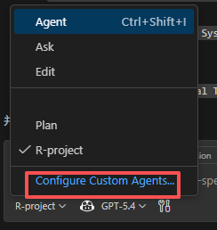
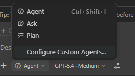
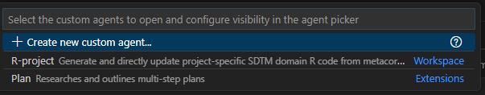
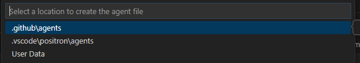
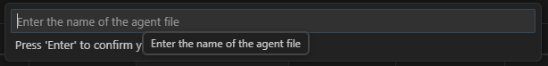
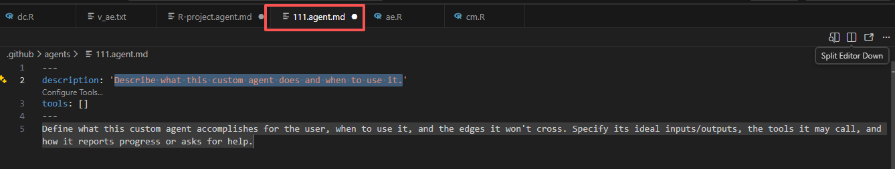
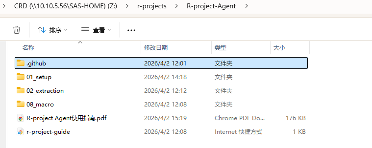
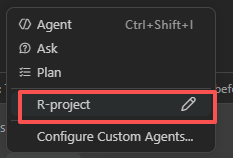

# R-project Agent 使用指南

> 作者: 王靖雅  
> 更新日期: 2026-04-02

## 使用前准备

1. 已安装 Positron 或 VS Code。
2. 当前环境支持使用部门 Copilot Chat / Agent 功能。

## 参考网页

- Positron 官网: https://positron.posit.co/
- Positron + Copilot 连接说明: https://positron.posit.co/assistant-getting-started.html
- Agent 搭建说明: https://positron.posit.co/assistant-chat-agents.html

## 如何创建自己的 Agent

在 Agent 选择界面，点击 `Configure Custom Agents`，进入 agent 配置页面后，点击 `Create New Agent`，输入 agent 名称和描述，即可创建自定义 agent。

 

## 如何导入现有 Agent

将 `Z:\r-projects\R-project-Agent` 下的 `.github` 文件夹复制到目标项目根目录，确保存在文件 `.github/agents/R-project.agent.md`。

完成后，使用 Positron 或 VS Code 打开该项目根目录，即可在 Chat 中选择 `R-project` agent 进行使用。

## 注意事项

1. 本 agent 主要针对 R 项目的 SDTM domain 编程任务以及当前 R pilot 项目框架设计，未尝试基于其他编
程任务或其他编程语⾔进⾏测试，使⽤前请确认任务类型和编程语⾔。
2.  如需尝试使⽤，建议搭建⼀个与项⽬隔离并包含参考代码的环境进⾏测试，避免在正式项⽬中直接使
⽤。
3. R pilot项⽬框架以及代码可参考 `Z:\r-projects\R-project-Agent` 中提供的内容，以及说明文档：[R项目框架说明](https://jingya221.github.io/SharingNotes/)。