```{r setup, include=FALSE}
options(htmltools.dir.version = FALSE,
        tibble.print_max = 5,
        tibble.print_min = 5,
        tibble.width     = 65)
knitr::opts_chunk$set(
  fig.width = 8, fig.height = 3.5, fig.retina = 2,
  out.width = "100%",
  cache = FALSE,
  echo = TRUE,
  message = FALSE,
  warning = FALSE,
  comment = ""
)

library(dplyr)

# 课堂演示数据集 ----
adsl <- tibble::tibble(
  USUBJID = sprintf("SUBJ%03d", 1:16),
  ARM = rep(c("Treatment A", "Treatment B"), each = 8),
  AGE = c(61,67,59,72,64,55,69,63,58,62,70,66,54,73,68,60),
  SEX = c(NA,"Female","Male","Male","Female","Female","Male","Female",
          "Female","Male","Male","Female","Female","Male","Female","Male"),
  RACE = c("Asian","Asian","White","Asian","White","Asian","Other","White",
           "Asian","White","White","Asian","Asian","Other","White","Asian"),
  ETHNIC = c("Not Hispanic or Latino","Not Hispanic or Latino",
             "Hispanic or Latino","Not Hispanic or Latino",
             "Not Hispanic or Latino","Hispanic or Latino",
             "Not Hispanic or Latino","Not Hispanic or Latino",
             "Not Hispanic or Latino","Not Hispanic or Latino",
             "Hispanic or Latino","Not Hispanic or Latino",
             "Not Hispanic or Latino","Hispanic or Latino",
             "Not Hispanic or Latino","Not Hispanic or Latino"),
  BMI = c(24.2,21.8,25.4,20.1,23.5,26.0,19.4,24.1,
          25.0,22.2,20.5,23.0,26.2,18.8,21.4,24.8)
) %>%
  mutate(
    AGEGR1   = if_else(AGE <= 65, "<=65", ">65")
  )
```

```{r xaringan-extra, echo=FALSE}
xaringanExtra::use_panelset()
xaringanExtra::use_tile_view()
xaringanExtra::use_clipboard()
xaringanExtra::use_animate_css()
xaringanExtra::use_progress_bar(color = "#2d6a9f", location = "bottom")
```

# 目录

.pull-left[
.toc-item[.toc-num[§ 1] [从一个 Table Shell 开始](#sec1)]
.toc-item[.toc-num[§ 2] [base R 出表](#sec2)]
.toc-item[.toc-num[§ 3] [tidyverse 出表](#sec3)]
.toc-item[.toc-num[§ 4] [rtables / tern 出表](#sec4)]
]

.pull-right[
.toc-item[.toc-num[§ 5] [表格输出方式总览](#sec5)]
.toc-item[.toc-num[§ 6] [Survival Analysis 入口](#sec6)]
.toc-item[.toc-num[★] [课后练习](#homework)]
]

.footnote[按 `O` 键鸟瞰所有幻灯片 &ensp;| 按 `←→` 键导航]

---
class: animated, fadeIn

# 本章逻辑

.pull-left[
### 讲课主线

1. **Table Shell**：先给出目标，明确要算什么
2. **计算规则**：连续变量 vs 分类变量
3. **base R 实现**：理解底层算法
4. **tidyverse 实现**：管道风格的出表思路
5. **rtables + tern 实现**：建立临床标准化表格思维
6. **输出**：RTF · Excel · Word/DOCX
7. **Survival Analysis**：时间事件分析的表格入口
]

.pull-right[
### 参考资料

| 包 | 文档 |
|---|---|
| rtables | [insightsengineering.github.io/rtables](https://insightsengineering.github.io/rtables/latest-release/) |
| tern | [insightsengineering.github.io/tern](https://insightsengineering.github.io/tern/latest-tag/) |
| formatters | [insightsengineering.github.io/formatters](https://insightsengineering.github.io/formatters/latest-tag/index.html) |
| r2rtf | [merck.github.io/r2rtf/](https://merck.github.io/r2rtf/) |
| openxlsx | [ycphs.github.io/openxlsx](https://ycphs.github.io/openxlsx/) |
| survival | R 自带推荐包 |
]

---
name: sec1
class: inverse, center, middle, animated, fadeIn

# § 1
# 从一个 Table Shell 开始

.section-num[1]

.footnote[[↑ 返回目录](#toc)]

---
class: animated, fadeIn

# 1.0 这张表需要计算什么

.pull-left[
### 典型 Demographics Table Shell

```
Table 14.1.2.1.1 Demographics (FAS)

                    Treatment A    Treatment B
                     (N=xx)         (N=xx)

Age (year)
  n                    xx             xx
  Mean                 xx.x           xx.x
  S.D.                 xx.xx          xx.xx
  Median               xx.x           xx.x
  Q1, Q3               xx.x, xx.x     xx.x, xx.x
  Min, Max             xx, xx         xx, xx

Age group (year), n (%)
  <= 65                xx (xx.x)      xx (xx.x)
  > 65                 xx (xx.x)      xx (xx.x)

Sex, n (%)
  Male                 xx (xx.x)      xx (xx.x)
  Female               xx (xx.x)      xx (xx.x)
```
]

.pull-right[
### 两大变量类型

.green-box[
**① 连续变量**  
`AGE`、`WEIGHT`、`BMI`  
→ n · Mean · SD · Median · Q1/Q3 · Min/Max
]

- `n` = 当前组该变量的**非缺失人数**
- 其他统计量也在非缺失值上计算

```{r eval=FALSE}
x <- c(61, 67, NA, 72, 64)
sum(!is.na(x))   # n = 4，不是 5
mean(x, na.rm = TRUE)
```


.tip-box[
**② 分类变量**  
`AGEGR1`、`SEX`、`RACE`、`ETHNIC`  
→ n (%) 按 level 展开
]

- `n` = 该 level 的人数
- `%` 的分母 = **当前 treatment group 的列总人数 N**

```{r eval=FALSE}
# 百分比用列分母 N，不是 level 总和
count / N_col * 100
```
]

---
name: stat-overview
class: animated, fadeIn

# 1.1 常见统计量与 R 函数对照

| 行标签 | 含义 | 常见 R 函数 |
|---|---|---|
| `n` | 非缺失样本数 | `sum(!is.na(x))` |
| `Mean` | 均值 | `mean(x, na.rm = TRUE)` |
| `S.D.` | 标准差 | `sd(x, na.rm = TRUE)` |
| `Median` | 中位数 | `median(x, na.rm = TRUE)` |
| `Q1, Q3` | 25% / 75% 分位数 | `quantile(x, probs = c(0.25, 0.75), na.rm = TRUE)` |
| `Min, Max` | 最小值与最大值 | `range(x, na.rm = TRUE)` |
| `n (%)` | 频数和百分比 | `table()` + `prop.table()` |

.warn-box[
**`sd()` 边界情况**：某组只有 1 个非缺失值时，`sd()` 返回 `NA`，这是统计上的正常行为，不是 bug。

**`quantile()` 算法**：默认 `type = 7`，如果 SAP 有固定口径（如 SAS 的 `PCTLDEF=5`），必须显式指定 `type`。→ [示例对比](#quantile-type-example)
]

---

name: quantile-type-example
class: animated, fadeIn

# 附：`quantile()` type 参数示例对比

.pull-left[

不同算法对样本分位数的定义不同，主要区别在于如何处理**边界点和插值方式**：

| R `type` | 说明 | 对应 SAS `PCTLDEF` | 
|---|---|---|
| `1` | 经验分布，无插值 | `4` |
| `2` | 不连续点取平均 | `5`（PROC MEANS 的分位数固定用 PCTLDEF=5） |
| `4` | 线性插值，分母为 n | - |
| `5` | 线性插值（Hazen 公式） | `2` |
| `6` | 线性插值，分母为 n+1 | `1` |
| `7` | **R 默认**，线性插值，基于 (n-1) 分段 | - |
| `8` | 基于分布近似的插值 | - |

.warn-box[
小样本时 `type = 7`（R 默认）与 SAS `type = 2` 的 Q1/Q3 可能不同。
需注意提前规定，避免默认行为带来的结果差异。
]
]

.pull-right[

**同一组数据，不同 type 的结果差异**

```{r}
x <- c(61, 67, 59, 72, 64, 55, 69, 63)

quantile(x, probs = c(0.25, 0.75), type = 7)  # R 默认
quantile(x, probs = c(0.25, 0.75), type = 2)  # SAS  PCTLDEF=5
```

.pull-left[
```{r echo=FALSE, out.width="90%", fig.align="center"}
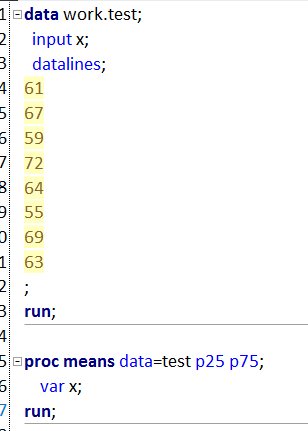
```
]
.pull-right[
```{r echo=FALSE, out.width="90%", fig.align="center"}
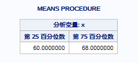
```
]

]

.footnote[[↑ 返回引用处](#stat-overview)]

---
class: animated, fadeIn

# 1.2 课堂演示数据集
.pull-left[
```{r eval=FALSE}
library(dplyr)

adsl <- tibble::tibble(
  USUBJID = sprintf("SUBJ%03d", 1:16),
  ARM     = rep(c("Treatment A", "Treatment B"), each = 8),
  AGE     = c(61, 67, 59, 72, 64, 55, 69, 63,
              58, 62, 70, 66, 54, 73, 68, 60),
  SEX     = c(NA,"Female","Male","Male","Female","Female","Male","Female",
              "Female","Male","Male","Female","Female","Male","Female","Male"),
  RACE    = c("Asian","Asian","White","Asian","White","Asian","Other","White",
              "Asian","White","White","Asian","Asian","Other","White","Asian"),
  BMI     = c(24.2,21.8,25.4,20.1,23.5,26.0,19.4,24.1,
              25.0,22.2,20.5,23.0,26.2,18.8,21.4,24.8)
) %>%
  mutate(
    AGEGR1   = if_else(AGE <= 65, "<=65", ">65")   #<<
  )
```
]
.pull-right[
```{r}
glimpse(adsl)
```
.note-box[`ARM`：列分组变量]

.tip-box[`AGE/BMI`：连续变量示例]

.tip-box[`AGEGR1/SEX/RACE`：分类变量示例]
]

---

name: sec2
class: inverse, center, middle, animated, fadeIn

# § 2
# 使用 base R 出表

.section-num[2]

.footnote[[↑ 返回目录](#toc)]

---
class: animated, fadeIn

# 2.0 base R 出表流程

.pull-left[
### 出表流程

.green-box[
**① 连续变量：单个计算 → 加格式 → 封装函数**  
先展示 `AGE` 一列算法，增加输出格式，再封装为函数 `build_cont_section()`
]

.tip-box[
**② 分类变量：单个计算 → n(%) 格式 → 封装函数**  
先展示 `SEX` 一列算法，增加输出格式，再封装为函数 `build_cat_section()`
]

.warn-box[
**③ 批量调用函数构建 section**  
`mapply()` 批量生成连续变量section和分类变量section
]

.note-box[
**④ 合并输出完整表**  
`do.call(rbind, ...)` 合并 section，列头加 `(N=xx)`
]
]

.pull-right[
### 本节用到的函数速查

| 函数 | 用途 |
|---|---|
| `quantile(x, type=7)` | 计算分位数（注意 `type` 参数） |
| `range(x, na.rm=TRUE)` | 最小值 / 最大值 |
| `formatC(x, format="f", digits=1)` | 数字格式化 |
| `split(x, group)` | 按分组拆数据为列表 |
| `lapply(list, fn)` | 对每组重复计算 |
| `mapply(fn, x, y)` | 多参数并行批量调用 |
| `table(arm, var)` | 二维频数表 |
| `prop.table(tab, margin=1)` | 按行计算比例 |
| `do.call(rbind, list_of_df)` | 批量纵向合并数据框 |

]

---
class: animated, fadeIn

# 2.1 连续变量：单个计算 → 加格式 → 封装

.panelset[
.panel[.panel-name[① 单个变量]
.pull-left[
```{r}
# 对单个连续变量 AGE 计算统计量
cont_stats <- function(x) {
  q <- quantile(x, probs = c(0.25, 0.75), na.rm = TRUE, names = FALSE)
  r <- range(x, na.rm = TRUE)
  list(
    n      = sum(!is.na(x)),
    mean   = mean(x, na.rm = TRUE),
    sd     = sd(x, na.rm = TRUE),
    median = median(x, na.rm = TRUE),
    q1     = q[1],
    q3     = q[2],
    min    = r[1],
    max    = r[2]
  )
}
```
]
.pull-right[
```{r}
cont_stats(adsl$AGE)
```
]
]
.panel[.panel-name[② 加格式]
.pull-left[
```{r}
fmt_num  <- function(x, d = 1) ifelse(is.na(x), "-",
              formatC(x, format = "f", digits = d))
fmt_pair <- function(x, y, d = 1, sep = ", ")
              paste0(fmt_num(x, d), sep, fmt_num(y, d))

cont_stats_to_rows <- function(x) {
  s <- cont_stats(x)
  c("n"        = as.character(s$n),
    "Mean"     = fmt_num(s$mean, 1),
    "S.D."     = fmt_num(s$sd,   2),
    "Median"   = fmt_num(s$median, 1),
    "Q1, Q3"   = fmt_pair(s$q1, s$q3, 1),
    "Min, Max" = fmt_pair(s$min, s$max, 0))
}

age_by_arm <- split(adsl$AGE, adsl$ARM)
lapply(age_by_arm, cont_stats_to_rows)
```
]
.pull-right[
### `formatC()` 参数说明

```{r}
# 核心参数：format="f" 固定小数位，digits 控制保留位数
formatC(12.3456, format = "f", digits = 0)  # "12"
formatC(12.3456, format = "f", digits = 1)  # "12.3"
formatC(12.3456, format = "f", digits = 2)  # "12.35" #<<
```

.tip-box[
本表使用以下三种精度规则：  
`Mean/Median`：保留 1 位小数；`S.D.`：保留 2 位小数；`Min, Max`：保留 0 位小数。
]

### `split()` 

.small[
`split(x, group)` 将向量/数据列按 `group` 的水平分割为列表，每个列表元素对应一个分组水平。  
此处将 `AGE` 按 `ARM` 分割为 Treatment A 与 Treatment B 两个子向量。

```{r}
str(split(adsl$AGE, adsl$ARM))
```
]
]
]
.panel[.panel-name[③ 封装为函数]
.pull-left[
.small[
**Step 1** `split()` & `lapply()` → 按组别拆分计算

```{r eval}
xs <- split(adsl[["AGE"]], adsl[["ARM"]])
stats_list <- lapply(xs, cont_stats_to_rows)
```

**Step 2** 搭 `row_label` 骨架（此时无数值列）

```{r}
stat_names <- names(stats_list[[1]])
out <- data.frame(
  row_label = c("Age (year)", paste0("  ", stat_names)),
  stringsAsFactors = FALSE
)
out
```

**Step 3** `for` 循环 → 逐列填入统计结果

```{r}
for (arm in names(stats_list)) out[[arm]] <- c("", stats_list[[arm]])
arm; names(stats_list); c("", stats_list[[arm]])
```
]
]
.pull-right[
```{r}
build_cont_section <- function(data, var, label, arm_var = "ARM") {
  xs         <- split(data[[var]], data[[arm_var]])
  stats_list <- lapply(xs, cont_stats_to_rows)
  stat_names <- names(stats_list[[1]])
  out <- data.frame(
    row_label = c(label, paste0("  ", stat_names)),
    stringsAsFactors = FALSE
  )
  for (arm in names(stats_list)) {
    out[[arm]] <- c("", stats_list[[arm]])
  }
  return(out)
}

build_cont_section(adsl, "AGE", "Age (year)")
```
.note-box[将上述固定计算流程封装为 `build_cont_section()`，可复用于任意连续变量。]
]
]
]

---
class: animated, fadeIn

# 2.2 分类变量：单个计算 → 加 n(%) → 封装

.panelset[
.panel[.panel-name[① 单个变量]
.pull-left[
```{r}
# 对单个分类变量 SEX 做频数和比例
tab_sex <- table(adsl$ARM, adsl$SEX)
tab_sex
```

```{r}
# 错误算法 ×
prop.table(tab_sex, margin = 1)
```

.warn-box[`prop.table()` 以各 level 非缺失样本量为分母计算比例，而临床表中 % 的分母须为**各组入组总人数 N**。
]
]
.pull-right[
```{r}
# 正确算法：列分母 = 每组 ARM 的实际入组总人数（来自 USUBJID）
denom <- table(adsl$ARM)
denom

# 手动算一个格：Treatment A / Female
tab_sex["Treatment A", "Female"] / denom["Treatment A"]
```

]
]
.panel[.panel-name[② 加 n(%) 格式]
.pull-left[
```{r}
fmt_n_pct <- function(count, denom, digits = 1) {
  pct <- ifelse(count == 0 | denom == 0, NA_real_, 100 * count / denom)
  paste0(count, 
         ifelse(!is.na(pct), 
                paste0(" (", 
                       formatC(pct, format = "f", digits = digits), 
                       ")"),
                "")
  )
}

denom <- table(adsl$ARM)
tab_sex <- table(adsl$ARM, adsl$SEX)
# 写法 A：for + mapply（明确但繁琐）
sex_out <- as.data.frame.matrix(tab_sex)
for (lv in names(sex_out))
  sex_out[[lv]] <- mapply(fmt_n_pct, sex_out[[lv]], denom)
t(sex_out)

# 写法 B：apply 直接对矩阵操作（更简洁）
sex_fmt <- apply(tab_sex, 2, \(col) fmt_n_pct(col, as.integer(denom)))
t(sex_fmt)
```
]
.pull-right[
### 两种写法的对比
.small[
**写法 A（for + mapply）**  
先把矩阵转成 data.frame，再逐列循环，`mapply` 把每列的 count 向量和 denom 向量对齐传给 `fmt_n_pct`：
]
```{r}
sex_out <- as.data.frame.matrix(tab_sex)
for (lv in names(sex_out)) #"Female" "Male"
  sex_out[[lv]] <- mapply(fmt_n_pct,  ## mapply(fmt_n_pct, c(3,4), c(8,8))
                          sex_out[[lv]], denom) 
```

.small[
**写法 B（apply）**  
`apply(tab_sex, 2, ...)` 直接对矩阵按列（`margin=2`）操作，每次传入一列（= 某个 SEX level 在各 ARM 的频数向量），配上 `denom` 向量即可：
]
```{r}
apply(tab_sex, 2, \(col) fmt_n_pct(col, as.integer(denom)))
```

.tip-box[
`apply(mat, 2, fn)` = 对矩阵每一**列**调用 `fn`；(相当于之前的for loop)
`apply(mat, 1, fn)` = 对矩阵每一**行**调用 `fn`。  
]

.note-box[两种写法结果相同，`apply` 版更简洁，`for+mapply` 版更容易逐步调试。]
]
]
.panel[.panel-name[③ 封装为函数]
.pull-left[
.small[
**Step 1** `table()` → 建频数矩阵 + 算列分母

```{r}
tab   <- table(adsl$ARM, adsl$SEX)
denom <- table(adsl$ARM)
```

**Step 2** 搭 `row_label` 骨架（此时无数值列）

```{r}
levels_var <- colnames(tab)
out <- data.frame(
  row_label = c("Sex, n (%)", paste0("  ", levels_var)),
  stringsAsFactors = FALSE
)
out
```

**Step 3** `for` 循环 → 逐行（每个 ARM）填入格式化值

```{r}
for (i in seq_len(nrow(tab))) {
  arm_name <- rownames(tab)[i]
  values   <- mapply(fmt_n_pct, tab[i, ], denom[i])
  out[[arm_name]] <- c("", values)
}
out
```
]
]
.pull-right[
```{r}
build_cat_section <- function(data, var, label, arm_var = "ARM") {
  tab        <- table(data[[arm_var]], data[[var]])
  denom      <- table(data[[arm_var]])  #<< 全体入组人数
  levels_var <- colnames(tab)
  out <- data.frame(
    row_label = c(label, paste0("  ", levels_var)),
    stringsAsFactors = FALSE
  )
  for (i in seq_len(nrow(tab))) {
    arm_name <- rownames(tab)[i]
    values   <- mapply(fmt_n_pct, tab[i, ], denom[i])
    out[[arm_name]] <- c("", values)
  }
  out
}

build_cat_section(adsl, "SEX", "Sex, n (%)")
```

.note-box[将上述固定计算流程封装为 `build_cat_section()`，可复用于任意分类变量。]
]
]
]

---
class: animated, fadeIn

# 2.3 合并输出完整 Demographics Table

.panelset[
.panel[.panel-name[连续变量批量]
.pull-left[
```{r}
cont_sections <- mapply(
  FUN   = build_cont_section,
  var   = c("AGE", "BMI"),
  label = c("Age (year)", "BMI"),
  MoreArgs = list(data = adsl),
  SIMPLIFY = FALSE
)

do.call(rbind, cont_sections)
```
]
.pull-right[
### `mapply()` 批量调用解析

`mapply` 是"多参数版的 `sapply`"，同时并行迭代多个向量：

| 参数 | 含义 |
|---|---|
| `FUN` | 要批量调用的函数 |
| `var` | 第一个变参：变量名列表 |
| `label` | 第二个变参：标题列表 |
| `MoreArgs` | **固定参数**：每次调用都传 `data = adsl` |
| `SIMPLIFY = FALSE` | 结果保持为 list，不压缩 |

**迭代过程相当于：**
```r
list(
  build_cont_section(adsl, "AGE", "Age (year)"),
  build_cont_section(adsl, "BMI", "BMI")
)
```

.tip-box[
`do.call(rbind, cont_sections)` 把 list 里每个 data.frame  
纵向合并成一张完整的连续变量汇总表。
]
]
]
.panel[.panel-name[分类变量批量]
.pull-left[
```{r}
cat_sections <- mapply(
  FUN   = build_cat_section,
  var   = c("AGEGR1", "SEX", "RACE"),
  label = c("Age group, n (%)",
            "Sex, n (%)",
            "Race, n (%)"),
  MoreArgs = list(data = adsl),
  SIMPLIFY = FALSE
)

do.call(rbind, cat_sections)
```
]
.pull-right[
### 与连续变量批量相同

只需替换两处：

| 连续变量批量 | 分类变量批量 |
|---|---|
| `FUN = build_cont_section` | `FUN = build_cat_section` |
| `var = c("AGE", "BMI")` | `var = c("AGEGR1", "SEX", "RACE")` |
| `label = c(...)` | `label = c(...)` |

其余参数（`MoreArgs`、`SIMPLIFY`、`do.call`）完全不变。

.green-box[
**新增变量只需两步：**  
① 在 `var` 向量末尾追加变量名  
② 在 `label` 向量末尾追加对应标题  
其余代码不动。
]
]
]
.panel[.panel-name[列头 + 合并输出]
.pull-left[
```{r}
col_n       <- table(adsl$ARM)
col_headers <- paste0(names(col_n), " (N=", as.integer(col_n), ")")

demo_table_base <- do.call(rbind, c(cont_sections, cat_sections))
names(demo_table_base) <- c("", col_headers)
```
.tip-box[
**base R 优点**：过程透明、调试友好、可精细定制  
**base R 代价**：模板代码较多，维护成本高于 tidyverse / rtables
]
]
.pull-right[
```{r}
print(demo_table_base, row.names = FALSE)
```
]
]
]

---

name: sec3
class: inverse, center, middle, animated, fadeIn

# § 3
# tidyverse 出表

.section-num[3]

.footnote[[↑ 返回目录](#toc)]

---
class: animated, fadeIn

# 3.0 tidyverse 出表流程

.pull-left[
### 出表流程

.green-box[
**① 连续变量：单个计算 → 加格式 → 封装函数**  
先展示 `AGE` 一列算法，增加输出格式，再封装为函数 `make_cont_section()`
]

.tip-box[
**② 分类变量：单个计算 → n(%) 格式 → 封装函数**  
先展示 `SEX` 一列算法，增加输出格式，再封装为函数 `make_cat_section()`
]

.warn-box[
**③ 批量调用函数构建 section**  
`map2()` 批量生成连续变量 section 和分类变量 section
]

.note-box[
**④ 合并输出完整表**  
`bind_rows()` 合并 section，列头加 `(N=xx)`
]
]

.pull-right[
### 本节用到的函数速查

| 函数 | 用途 |
|---|---|
| `group_by()` | 按变量分组 |
| `summarise(...)` | 分组统计，返回 data.frame |
| `count()` | 快速频数，替代 `table()` |
| `filter(!is.na())` | 过滤缺失行 |
| `left_join()` | 合并列分母 N |
| `mutate()` | 格式化为 n (%) 字符串 |
| `pivot_longer/wider` | 长宽格式互转 |
| `map2(fn, x, y)` | 多参数并行批量调用（purrr）|
| `bind_rows(list)` | 批量纵向合并 data.frame |
]

---
class: animated, fadeIn

# 3.1 连续变量：单个计算 → 加格式 → 封装

.panelset[
.panel[.panel-name[① 单个变量]
```{r}
# group_by + summarise：按 ARM 分组，对 AGE 计算各统计量
adsl %>%
  group_by(ARM) %>% #<<
  summarise(
    n      = sum(!is.na(AGE)),
    mean   = mean(AGE, na.rm = TRUE),
    sd     = sd(AGE, na.rm = TRUE),
    median = median(AGE, na.rm = TRUE),
    q1     = quantile(AGE, 0.25, na.rm = TRUE),
    q3     = quantile(AGE, 0.75, na.rm = TRUE),
    min    = min(AGE, na.rm = TRUE),
    max    = max(AGE, na.rm = TRUE)
  ) %>% 
  ungroup()
```
]
.panel[.panel-name[② 加格式 + 整形]
.pull-left[
```{r eval=FALSE}
# summarise 内直接格式化为字符串，再 pivot 整形为出表结构
adsl %>%
  group_by(ARM) %>%
  summarise(
    n          = as.character(sum(!is.na(AGE))),
    Mean       = formatC(mean(AGE, na.rm = TRUE),   format = "f", digits = 1),
    `S.D.`     = formatC(sd(AGE, na.rm = TRUE),     format = "f", digits = 2),
    Median     = formatC(median(AGE, na.rm = TRUE), format = "f", digits = 1),
    `Q1, Q3`   = paste0(
                   formatC(quantile(AGE, 0.25, na.rm = TRUE), format = "f", digits = 1),
                   ", ",
                   formatC(quantile(AGE, 0.75, na.rm = TRUE), format = "f", digits = 1)),
    `Min, Max` = paste0(min(AGE, na.rm = TRUE), ", ", max(AGE, na.rm = TRUE)),
    .groups = "drop"
  ) %>%
  tidyr::pivot_longer(-ARM, names_to = "row_label") %>%  #<< 统计量名 → 行
  tidyr::pivot_wider(names_from = ARM, values_from = value) #<< ARM → 列
```
]
.pull-right[
.small[
**① summarise 后（宽格式，每列一个统计量）**
```{r echo=FALSE}
adsl %>%
  group_by(ARM) %>%
  summarise(
    n          = as.character(sum(!is.na(AGE))),
    Mean       = formatC(mean(AGE, na.rm = TRUE),   format = "f", digits = 1),
    `S.D.`     = formatC(sd(AGE, na.rm = TRUE),     format = "f", digits = 2),
    Median     = formatC(median(AGE, na.rm = TRUE), format = "f", digits = 1),
    `Q1, Q3`   = paste0(
                   formatC(quantile(AGE, 0.25, na.rm = TRUE), format = "f", digits = 1),
                   ", ",
                   formatC(quantile(AGE, 0.75, na.rm = TRUE), format = "f", digits = 1)),
    `Min, Max` = paste0(min(AGE, na.rm = TRUE), ", ", max(AGE, na.rm = TRUE)),
    .groups = "drop"
  )
```

**② pivot_longer 后（长格式，统计量名变行）**
```{r echo=FALSE}
adsl %>%
  group_by(ARM) %>%
  summarise(
    n          = as.character(sum(!is.na(AGE))),
    Mean       = formatC(mean(AGE, na.rm = TRUE),   format = "f", digits = 1),
    `S.D.`     = formatC(sd(AGE, na.rm = TRUE),     format = "f", digits = 2),
    Median     = formatC(median(AGE, na.rm = TRUE), format = "f", digits = 1),
    `Q1, Q3`   = paste0(
                   formatC(quantile(AGE, 0.25, na.rm = TRUE), format = "f", digits = 1),
                   ", ",
                   formatC(quantile(AGE, 0.75, na.rm = TRUE), format = "f", digits = 1)),
    `Min, Max` = paste0(min(AGE, na.rm = TRUE), ", ", max(AGE, na.rm = TRUE)),
    .groups = "drop"
  ) %>%
  tidyr::pivot_longer(-ARM, names_to = "row_label")
```

**③ pivot_wider 后（ARM 变列，出表结构）**
```{r echo=FALSE}
adsl %>%
  group_by(ARM) %>%
  summarise(
    n          = as.character(sum(!is.na(AGE))),
    Mean       = formatC(mean(AGE, na.rm = TRUE),   format = "f", digits = 1),
    `S.D.`     = formatC(sd(AGE, na.rm = TRUE),     format = "f", digits = 2),
    Median     = formatC(median(AGE, na.rm = TRUE), format = "f", digits = 1),
    `Q1, Q3`   = paste0(
                   formatC(quantile(AGE, 0.25, na.rm = TRUE), format = "f", digits = 1),
                   ", ",
                   formatC(quantile(AGE, 0.75, na.rm = TRUE), format = "f", digits = 1)),
    `Min, Max` = paste0(min(AGE, na.rm = TRUE), ", ", max(AGE, na.rm = TRUE)),
    .groups = "drop"
  ) %>%
  tidyr::pivot_longer(-ARM, names_to = "row_label") %>%
  tidyr::pivot_wider(names_from = ARM, values_from = value)
```
]
]
]
.panel[.panel-name[③ 封装为函数]
```{r}
# 把 ② 的代码参数化：将固定的 AGE 换成 .data[[var]]，其余不变
make_cont_section <- function(data, var, label, arm_var = "ARM") {
  data %>%
    group_by(.data[[arm_var]]) %>%
    summarise(
      n          = as.character(sum(!is.na(.data[[var]]))),
      Mean       = formatC(mean(.data[[var]], na.rm = TRUE),   format = "f", digits = 1),
      `S.D.`     = formatC(sd(.data[[var]], na.rm = TRUE),     format = "f", digits = 2),
      Median     = formatC(median(.data[[var]], na.rm = TRUE), format = "f", digits = 1),
      `Q1, Q3`   = paste0(
                     formatC(quantile(.data[[var]], 0.25, na.rm = TRUE), format = "f", digits = 1),
                     ", ",
                     formatC(quantile(.data[[var]], 0.75, na.rm = TRUE), format = "f", digits = 1)),
      `Min, Max` = paste0(min(.data[[var]], na.rm = TRUE), ", ", max(.data[[var]], na.rm = TRUE)),
      .groups = "drop"
    ) %>%
    tidyr::pivot_longer(-all_of(arm_var), names_to = "row_label") %>%
    tidyr::pivot_wider(names_from = all_of(arm_var), values_from = value) %>%
    bind_rows(tibble::tibble(row_label = label), .)  #<< 顶部插入变量标题行
}

make_cont_section(adsl, var = "AGE", label = "Age (year)")
```
]
]

---
class: animated, fadeIn

# 3.2 分类变量：单个计算 → 加 n(%) → 封装

.panelset[
.panel[.panel-name[① 单个变量]
.pull-left[
```{r}
# count()：按 ARM × SEX 计频数，结果直接是 data.frame
adsl %>% count(ARM, SEX)
```

```{r}
# pivot_wider：让 ARM 变成列（宽格式）
adsl %>%
  count(ARM, SEX) %>%
  tidyr::pivot_wider(names_from = ARM, values_from = n)
```
]
.pull-right[
```{r}
# 先算各组总人数 N（在过滤 NA 之前）
N_df <- count(adsl, ARM, name = "N")
N_df
```

```{r}
# count 频数 + left_join 合并分母 → 计算百分比
adsl %>%
  filter(!is.na(SEX)) %>%           #<< 过滤 NA
  count(ARM, SEX) %>%
  left_join(N_df, by = "ARM") %>%   #<< 合并列分母 N
  mutate(pct = formatC(n / N * 100, format = "f", digits = 1))
```
]
]
.panel[.panel-name[② 加 n(%) 格式 + 整形]
```{r}
# 先算各组总 N（在过滤 NA 之前），再 count 频数，left_join 合并分母
N_df <- count(adsl, ARM, name = "N")  #<< 全体入组人数，不受 SEX 缺失影响

adsl %>%
  filter(!is.na(SEX)) %>%                              #<< 过滤掉 SEX 缺失行
  count(ARM, SEX) %>%
  left_join(N_df, by = "ARM") %>%                     #<< 合并列分母 N
  mutate(
    cell = paste0(n, ifelse(n>0, 
                            paste0(" (", formatC(n / N * 100, format = "f", digits = 1), ")"),
                            ""))
  ) %>%
  select(ARM, row_label = SEX, cell) %>%
  tidyr::pivot_wider(names_from = ARM, values_from = cell)
```
]
.panel[.panel-name[③ 封装为函数]
```{r}
# 把 ② 的代码参数化：将固定的 SEX 换成 .data[[var]]，其余不变
make_cat_section <- function(data, var, label, arm_var = "ARM") {
  N_df <- count(data, .data[[arm_var]], name = "N")  #<< 先算总 N，不受 var 缺失影响
  data %>%
    filter(!is.na(.data[[var]])) %>%                  #<< 过滤掉 var 缺失行
    count(.data[[arm_var]], .data[[var]]) %>%
    left_join(N_df, by = arm_var) %>%                 #<< 合并列分母 N
    mutate(cell = paste0(n, ifelse(n > 0,
                                   paste0(" (", formatC(n / N * 100, format = "f", digits = 1), ")"),
                                   ""))) %>%
    select(ARM = .data[[arm_var]], row_label = .data[[var]], cell) %>%
    tidyr::pivot_wider(names_from = ARM, values_from = cell) %>%
    bind_rows(tibble::tibble(row_label = label), .)  #<< 顶部插入变量标题行
}

make_cat_section(adsl, var = "SEX", label = "Sex, n (%)")
```
.note-box[与 `make_cont_section` 模式完全一致：固定变量名 → 参数，末尾追加 `label` 标题行。两个函数输出结构相同（`row_label | Arm A | Arm B`），可以直接 `bind_rows()`。]
]
]

---
class: animated, fadeIn

# 3.3 批量调用 + 合并输出

.panelset[
.panel[.panel-name[批量调用]
.pull-left[
```{r}
library(purrr)

# 连续变量：map2 对每个 (var, label) 对调用 make_cont_section（3.1 定义的函数）
cont_sections <- map2(
  c("AGE",        "BMI"),
  c("Age (year)", "BMI"),
  \(var, lbl) make_cont_section(adsl, var, lbl)  #<<
) %>%
  bind_rows()

# 分类变量：同样的模式
cat_sections <- map2(
  c("SEX",        "AGEGR1",           "RACE"),
  c("Sex, n (%)", "Age group, n (%)", "Race, n (%)"),
  \(var, lbl) make_cat_section(adsl, var, lbl)   #<<
) %>%
  bind_rows()
```
.tip-box[新增变量：仅需在 `c("AGE", "BMI", ...)` 末尾追加变量名及对应 label，其余代码保持不变。]
]
.pull-right[
.small[
### `map2()` 批量调用解析

`map2(.x, .y, .f)` 是 `purrr` 里的"双向量并行迭代"函数，同时遍历 `.x` 和 `.y` 的第 i 个元素：

| 参数 | 含义 |
|---|---|
| `.x` | 第一个变参向量：变量名 |
| `.y` | 第二个变参向量：标题 label |
| `.f` | 每次迭代调用的函数（匿名函数） |

**迭代过程相当于：**
```{r eval=FALSE}
list(
  make_cont_section(adsl, "AGE", "Age (year)"),
  make_cont_section(adsl, "BMI", "BMI")
)
```

.tip-box[
`map2()` 返回一个 **list**，每个元素是一个 tibble；  
末尾 `%>% bind_rows()` 把整个 list 纵向拼合为一张表。
]

.note-box[
与 base R 的 `mapply()` 对比：  
`mapply(FUN, var=..., label=..., MoreArgs=list(data=adsl), SIMPLIFY=FALSE)`  
→ `map2(vars, labels, \(v,l) fn(adsl, v, l)) %>% bind_rows()`  
两者逻辑相同，tidyverse 写法更简洁，函数参数可以直接写在函数内部。
]
]
]
]
.panel[.panel-name[列头+合并输出]
.pull-left[
```{r}
# cont_sections / cat_sections 各自已含 section 标题行，直接合并
demo_tidy <- bind_rows(cont_sections, cat_sections)

# 加列头 N=xx
col_n_tidy       <- table(adsl$ARM)
col_headers_tidy <- paste0(names(col_n_tidy), " (N=",
                            as.integer(col_n_tidy), ")")
names(demo_tidy) <- c("", col_headers_tidy)
```
.tip-box[
tidyverse 优势：**每一步都返回整洁的 data.frame**，  
不需要在 list、matrix、named vector 之间来回转换。
]
]
.pull-right[
```{r, R.options=list(tibble.print_max=Inf, tibble.print_min=Inf)}
print(demo_tidy) ## 注：row.names = FALSE只能限制dataframe的输出格式，对tibble无效
```
]
]
]

---

name: sec4
class: inverse, center, middle, animated, fadeIn

# § 4
# 使用 rtables / tern 出表

.section-num[4]

.footnote[[↑ 返回目录](#toc)]

---
class: animated, fadeIn

# 4.1 rtables 核心概念

.pull-left[
### 两个要素 → 一张表
```{r echo=FALSE, out.width="90%", fig.align="center"}
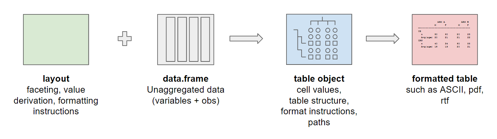
```

```
layout（布局描述）
    +
data.frame（原始未聚合数据）
    ↓
build_table()
    ↓
table 对象（可打印 / RTF / HTML）
```

.green-box[
**核心特征**：layout 为 pre-data 对象——它描述了数据传入后表格的构建规则，与 base R / tidyverse 先计算后拼表的模式**不同**。
]

.note-box[
每个单元格对应一个**数据子集**：  
列分割确定各列对应的受试者范围-"哪些人进这一列"，  
行分割确定各行对应的数据分层-"哪些行进这一组"，  
`analyze()` 在该子集上执行统计函数。
]
]

.pull-right[
### 本节核心函数一览

| 函数 | 层次 | 作用 |
|---|---|---|
| `basic_table()` | 起点 | 初始化布局（0行1列）|
| `split_cols_by()` | 列结构 | 按变量拆列，数据随之分区 |
| `split_rows_by()` | 行结构 | 按变量拆行，生成层级分组 |
| `summarize_row_groups()` | 行结构 | 在分组标题行显示 n (%) |
| `analyze()` | 分析 | 对变量调用自定义分析函数 |
| `build_table()` | 执行 | 把 layout + data 合并生成表 |

.tip-box[
`rtables` 负责**表格结构和布局**  
`formatters` 负责**单元格内容怎么显示**  
`tern` 负责**常见临床统计分析函数**，如 `g_lineplot()`、`summarize_coxreg()`。
]
]

---
class: animated, fadeIn

# 4.2 rtables 的两种核心对象

.pull-left[
### ① Layout：`PreDataTableLayouts`

```{r}
library(rtables)

lyt <- basic_table(show_colcounts = TRUE) %>%
  split_cols_by("ARM") %>%
  analyze("AGE", mean, format = "xx.x")

class(lyt)

lyt
```
.note-box[
layout 为**纯结构描述对象**，不包含任何数据或计算结果。  
同一个 layout 可应用于不同数据集（如主数据集 / 亚组数据集 / 不同分析集数据）。
]
]

.pull-right[
### ② Table：`ElementaryTable`

```{r}
tbl <- build_table(lyt, adsl)

class(tbl)

tbl  # 打印出 ASCII 格式的表格
```

.green-box[
`ElementaryTable` 是 rtables 的表对象，内部保存**未四舍五入的原始数值**，  
渲染（ASCII / RTF / HTML）是在显示时才应用格式标签。  
表对象内部始终保存原始精度数值，可通过 `cell_values()` 随时提取。
]

```{r eval=FALSE}
cell_values(tbl) # 从表对象里提取单元格原始值
```
]
.tip-box[
两步工作流的优势：同一 layout 可复用于多个数据集，同一数据集亦可应用不同 layout。
]

---
class: animated, fadeIn

# 4.3 逐步构建 layout：每加一行代码，表格多一层结构

.panelset[
.panel[.panel-name[Step 1：基础骨架]
.pull-left[
**代码**
```{r}
library(rtables)

lyt1 <- basic_table() %>%
  analyze("AGE", mean, format = "xx.x") #<<

tbl1 <- build_table(lyt1, adsl)
```
]
.pull-right[
**输出**
```{r echo=FALSE}
tbl1
```
.green-box[
`basic_table()` 起点：0 行、**1 列（所有数据）**  
`analyze()` 在这一列上调用 `mean(AGE)`  
`build_table()` 负责将 layout 应用于数据并执行计算
]
]
]
.panel[.panel-name[Step 2：加列分割]
.pull-left[
**代码**
```{r}
lyt2 <- basic_table(show_colcounts = TRUE) %>%
  split_cols_by("ARM") %>%  #<<
  analyze("AGE", mean, format = "xx.x")

tbl2 <- build_table(lyt2, adsl)
```
]
.pull-right[
**输出**
```{r echo=FALSE}
tbl2
```
.green-box[
`split_cols_by("ARM")` = **数据按列分区**  
第1列 ← `adsl[ARM=="Treatment A", ]`  
第2列 ← `adsl[ARM=="Treatment B", ]`  
每列的 `mean()` 仅作用于该列对应的数据子集
]
]
]
.panel[.panel-name[Step 3：加行分割]
.pull-left[
**代码**
```{r}
lyt3 <- basic_table(show_colcounts = TRUE) %>%
  split_cols_by("ARM") %>%
  split_rows_by("AGEGR1") %>%  #<<
  analyze("AGE", mean, format = "xx.x")

tbl3 <- build_table(lyt3, adsl)
```
]
.pull-right[
**输出**
```{r echo=FALSE}
tbl3
```
.green-box[
`split_rows_by("AGEGR1")` = **数据同时在行维度分区**  
每个单元格 = 列子集 ∩ 行子集 的计算结果  
行分割可无限嵌套（如 SOC → PT 的 AE 表）
]
]
]
.panel[.panel-name[Step 4：分组行加 n(%)]
.pull-left[
**代码**
```{r}
lyt4 <- basic_table(show_colcounts = TRUE) %>%
  split_cols_by("ARM") %>%
  split_rows_by("SEX") %>%
  summarize_row_groups() %>%  #<<
  analyze("AGE", mean, format = "xx.x")

adsl2 <- tern::df_explicit_na(adsl)
tbl4 <- build_table(lyt4, adsl2)
```
]
.pull-right[
**输出**
```{r echo=FALSE}
tbl4
```
.green-box[
`summarize_row_groups()` 将原为标签行的分组标识  
转换为**同时展示 n (%)** 的内容行  
% 分母取自该列总人数 N，由 rtables 自动处理，无需手动计算 `denom`
]
.warn-box[`summarize_row_groups()` 必须紧接在 `split_rows_by()` 之后]

.note-box[
**`tern::df_explicit_na(adsl)`**：  
`SEX` 列含有 `NA`，`df_explicit_na()` 把所有因子列的 `NA` 转换为显式的 `"<Missing>"` level，使缺失值**作为单独一行出现在表格里**。
]
]
]
.panel[.panel-name[Cheat sheet]
```{r echo=FALSE, out.width="70%", fig.align="center"}
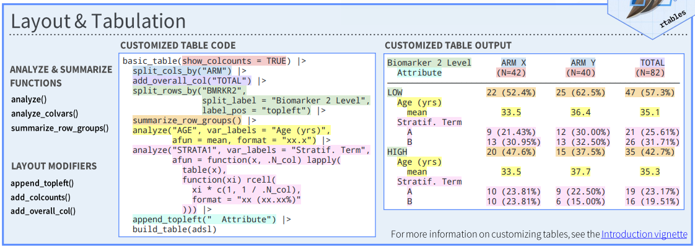
```
```{r echo=FALSE, out.width="70%", fig.align="center"}
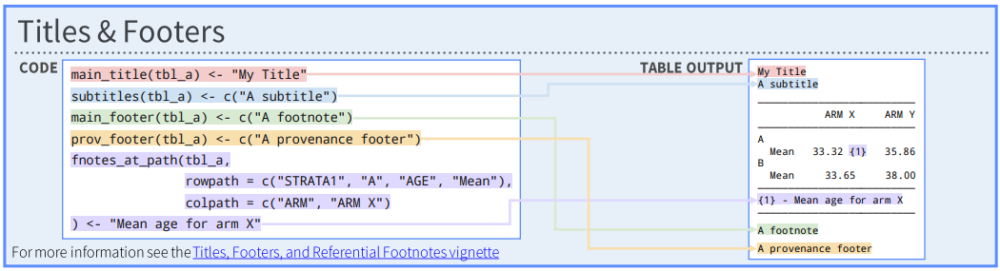
```
]
]

---
class: animated, fadeIn

# 4.4 加格式：`formatters` 简介

.panelset[
.panel[.panel-name[基础介绍]
.pull-left[
### 功能定位

`formatters` 提供两项核心功能，均服务于 **ASCII 渲染**：

1. **`format_value()`**：将单值或多值数值向量格式化为 ASCII 可显示字符串
2. **`matrix_form` 框架**：为表格对象提供通用的 ASCII 渲染接口（Generic）

两项功能均被 `rtables` 内部调用。

.green-box[
**定位说明**  
`formatters` 专注于表格的**显示层**，不参与统计计算。  
其核心职责是将原始数值转换为符合格式规范的展示文本，  
等价于 base R 中 `formatC()` / `sprintf()` / `paste()` 的组合，  
但与 `rtables` 的 layout/cell 体系深度集成。
]

### 三个核心函数

| 函数 | 作用 |
|---|---|
| `format_value()` | 将原始数值格式化为字符串（底层验证接口）|
| `rcell()` | 构造携带格式标签的单元格对象 |
| `in_rows()` | 将多个 `rcell` 组合为 `afun` 的多行返回值 |
]

.pull-right[
### `format_value()` 使用示例

```{r eval=FALSE}
library(formatters)

# 单值格式化：保留 2 位小数
format_value(5.1235, format = "xx.xx")
# [1] "5.12"

# 二元向量格式化：两值并列
format_value(c(1.2355, 2.6789), "(xx.xx, xx.xx)")
# [1] "(1.24, 2.68)"

# 二元向量格式化：n (%)
format_value(c(5, 62.5), "xx (xx.x%)")
# [1] "5 (62.5%)"
```

.note-box[
`format_value()` 为底层验证接口，可在开发阶段用于确认格式标签的行为是否符合预期。  
`rcell()` 的 `format = "..."` 参数采用相同的格式标签体系。
]
]
]
.panel[.panel-name[格式标签速查]
.pull-left[
.small[
.tip-box[
查看全部支持的格式标签：  
`formatters::list_valid_format_labels()`
]
]
### 格式标签语法

格式标签中每个 `xx` 对应输入数值向量中的一个元素：

| 标记 | 含义 |
|---|---|
| `xx` | 原样输出，不做数值转换 |
| `xx.` | 四舍五入至 0 位小数 |
| `xx.x` | 保留 1 位小数 |
| `xx.xx` | 保留 2 位小数 |
| `xx.xxx` | 保留 3 位小数 |

### 单值格式（1d）
| 格式标签 | 示例输入 | 输出 |
|---|---|---|
| `"xx"` | `5` | `5` |
| `"xx.x"` | `63.87` | `63.9` |
| `"xx.xx"` | `63.87` | `63.87` |
| `"xx%"` | `62.5` | `62.5%` |
| `"(N=xx)"` | `8` | `(N=8)` |

]

.pull-right[
### 双值格式（2d）——临床表常用
| 格式标签 | 典型应用场景 |
|---|---|
| `"xx (xx.x%)"` | 分类变量 n (%) |
| `"xx.x (xx.xx)"` | Mean (SD) |
| `"xx.x - xx.x"` | Q1 − Q3 / 置信区间 |
| `"xx.x, xx.x"` | Q1, Q3 |
| `"(xx.x, xx.x)"` | (Q1, Q3) 带括号形式 |
| `"xx / xx (xx.x%)"` | 事件数 / 总数 (%) |
| `"xx.x to xx.x"` | 范围（以 "to" 连接）|

### 三值格式（3d）
| 格式标签 | 典型应用场景 |
|---|---|
| `"xx.x (xx.x - xx.x)"` | Estimate (95% CI) |
| `"xx / xx (xx.x%)"` | Responders / N (%) |

.note-box[
每种格式标签要求输入向量的**长度与 `d` 维数一致**，  
传入长度不匹配的向量会报错。
]
]
]
.panel[.panel-name[rcell 与 in_rows]
.pull-left[
### `rcell()` — 单元格对象

`rcell(value, format)` 将数值向量与格式标签绑定，  
返回一个 rtables 内部单元格对象（不在此阶段执行格式化）：

```{r}
class(rcell(63.9, format = "xx.x"))

# 单值
rcell(63.9, format = "xx.x")

# 二元向量：n (%)
rcell(c(5, 62.5), format = "xx (xx.x%)")

# 二元向量：Q1, Q3
rcell(c(59.5, 68.0), format = "xx.x, xx.x")

# 三元向量：Estimate (95% CI)
rcell(c(0.85, 0.62, 1.17), format = "xx.xx (xx.xx - xx.xx)")
```

.note-box[
格式化的实际执行发生在 `build_table()` 的渲染阶段，  
`rcell()` 仅完成值与格式标签的绑定。
]
]

.pull-right[
### `in_rows()` — 多行返回值

`in_rows()` 将多个命名 `rcell()` 组合为 `afun` 的返回对象，  
每个命名参数对应表格中的一行（行标签 + 单元格内容）：

```{r eval=FALSE}
cont_afun <- function(x, .N_col, ...) {
  q <- quantile(x, c(0.25, 0.75), na.rm = TRUE,
                names = FALSE)
  r <- range(x, na.rm = TRUE)

  in_rows(
    "n"        = rcell(sum(!is.na(x)),
                       format = "xx"),
    "Mean"     = rcell(mean(x, na.rm = TRUE),
                       format = "xx.x"),
    "S.D."     = rcell(sd(x, na.rm = TRUE),
                       format = "xx.xx"),
    "Median"   = rcell(median(x, na.rm = TRUE),
                       format = "xx.x"),
    "Q1, Q3"   = rcell(q, format = "xx.x, xx.x"),
    "Min, Max" = rcell(r, format = "xx, xx")
  )
}
```

.tip-box[
`in_rows()` 的返回值为 rtables 内部类型，  
`build_table()` 负责将其映射至表格的对应行位置。
]
]
]
.panel[.panel-name[afun 是什么]
.pull-left[
### `afun`：Analysis Function

`afun` 是传递给 `analyze()` 的**自定义分析函数**，  
用于定义该变量在每个数据子集上执行的统计计算及其输出格式：

```{r eval=FALSE}
analyze("AGE", afun = my_fn)
```

**执行机制**：对每个数据子集（列分割 × 行分割的交叉），  
rtables 依次执行以下操作：

1. 提取该子集中目标变量的数值向量 `x`
2. 将列总样本量注入为参数 `.N_col`
3. 调用 `afun(x, .N_col, ...)`
4. 将返回的 `in_rows()` 对象填入表格对应位置

.green-box[
**使用 `afun` 的必要性**  
- `analyze("AGE", mean)`：仅支持单行单统计量输出  
- `analyze("AGE", afun = cont_afun)`：可输出任意行数，每行独立指定格式  
- 访问 `.N_col`（列分母 N）须通过 `afun` 参数接收，直接传函数无法获取
]
]

.pull-right[
### `afun` 函数签名规范

```{r eval=FALSE}
my_afun <- function(
    x,        # 当前数据子集的目标变量向量（必需）
    .N_col,   # 当前列的总样本量（由 rtables 自动注入）
    .N_row,   # 当前行子集的样本量（可选）
    ...) {    # rtables 保留的扩展参数
  # 统计计算逻辑
  in_rows(
    "行标签" = rcell(计算值, format = "格式标签"),
    ...
  )
}
```

### `afun` 与直接传函数的对比

| 比较维度 | 直接传函数 | 使用 `afun` |
|---|---|---|
| 调用方式 | `analyze("AGE", mean)` | `analyze("AGE", afun = fn)` |
| 输出行数 | 固定 1 行 | 任意多行 |
| 格式控制 | 统一 `format=` | 每行独立 `rcell(format=)` |
| 访问 `.N_col` | 不支持 | 支持 |
| 适用场景 | 快速验证、单一统计量 | 生产表格、复合统计量 |

.warn-box[
`afun` 的返回值必须为 `in_rows()` 对象；  
返回普通向量或数据框将导致 `build_table()` 报错。
]
]
]
]

---
class: animated, fadeIn

# 4.5 用 rtables 拼出完整 Demographics Table
.panelset[
.panel[.panel-name[代码]
.pull-left[
### ① 定义两个 `afun`

```{r}
library(rtables); library(formatters)

# 连续变量：n / Mean / SD / Median / Q1,Q3 / Min,Max
cont_afun <- function(x, .N_col, ...) {
  q <- quantile(x, probs = c(0.25, 0.75),
                na.rm = TRUE, names = FALSE)
  r <- range(x, na.rm = TRUE)
  in_rows(
    "n"        = rcell(sum(!is.na(x)),        format = "xx"),
    "Mean"     = rcell(mean(x, na.rm = TRUE), format = "xx.x"),
    "S.D."     = rcell(sd(x,   na.rm = TRUE), format = "xx.xx"),
    "Median"   = rcell(median(x,na.rm=TRUE),  format = "xx.x"),
    "Q1, Q3"   = rcell(q,                     format = "xx.x, xx.x"),
    "Min, Max" = rcell(r,                     format = "xx, xx")
  )
}

# 分类变量：每个 level → n (%)
# .N_col = 该列的总人数 N（由 rtables 自动传入），无需手动计算
cat_afun <- function(x, .N_col, ...) {
  counts <- table(x)
  in_rows(
    .list  = lapply(counts,
               \(n) rcell(c(n, n / .N_col),
                          format = "xx (xx.x%)")),
    .names = names(counts)
  )
}
```

]

.pull-right[
### ② 链式 `analyze()` 拼表

```{r}
adsl2 <- tern::df_explicit_na(adsl)  # NA → "<Missing>" level

lyt_demo <- basic_table(show_colcounts = TRUE) %>%
  split_cols_by("ARM") %>%
  analyze("AGE",    afun = cont_afun, var_labels = "Age (year)") %>%
  analyze("BMI",    afun = cont_afun, var_labels = "BMI") %>%
  analyze("AGEGR1", afun = cat_afun, var_labels = "Age group, n (%)") %>%
  analyze("SEX",    afun = cat_afun, var_labels = "Sex, n (%)") %>%
  analyze("RACE",   afun = cat_afun, var_labels = "Race, n (%)")

demo_table_rtables <- build_table(lyt_demo, adsl2)
```

]
]
.panel[.panel-name[结果展示]
.pull-left[
```{r}
demo_table_rtables
```
]
.pull-right[
.green-box[
**与 §2 / §3 的对比**

| | §2 base R | §3 tidyverse | §4 rtables |
|---|---|---|---|
| 按列分组 | `split()` | `group_by()` | `split_cols_by()` 自动 |
| 格式化 | `formatC()` | `formatC()` | `rcell(format=)` |
| 拼表 | `do.call(rbind)` | `bind_rows()` | layout 链式追加 |
| 分母 N | 手动 `denom` | 手动 `N_df` | `.N_col` 自动注入 |
]
]
]
]

---
class: animated, fadeIn

# 4.6 tern 是什么？rtables vs tern 的关系

.pull-left[
### 层次关系

```
┌─────────────────────────────┐
│           tern              │  ← 临床分析函数库
│  analyze_vars()             │
│  count_occurrences()        │
│  surv_time()  coxph_...()   │
├─────────────────────────────┤
│          rtables            │  ← 表格布局引擎
│  basic_table()              │
│  split_cols/rows_by()       │
│  analyze()  build_table()   │
├─────────────────────────────┤
│         formatters          │  ← 显示层
│  rcell()  in_rows()         │
│  export_as_rtf()            │
└─────────────────────────────┘
```

.note-box[
`tern` 的各函数本质上均调用 `rtables` 的 `analyze()`，  
其核心作用在于将临床常用统计函数**预先封装**为高层接口。
]
]

.pull-right[
### rtables vs tern 对比

| 维度 | rtables | tern |
|---|---|---|
| 定位 | 通用表格引擎 | 临床分析函数包 |
| 灵活性 | 极高，需自写 `afun` | 中，参数化控制 |
| 开发成本 | 高（每个统计量手写）| 低（直接调用） |
| 扩展性 | 可实现任意统计 | 覆盖 TFL 常见场景 |
| 输出格式 | ASCII / RTF / HTML | 同 rtables |

.green-box[
**实际用法**：  
- 标准临床表 → 直接用 `tern` 的高层函数  
- 非标准统计或复杂定制 → 退回 rtables `analyze()` + 自定义 `afun`  
两者可以在同一个 layout 里**混用**
]

### tern 覆盖的常见场景

| 函数 | 用途 |
|---|---|
| `analyze_vars()` | 连续/分类变量汇总 |
| `count_occurrences()` | AE/MH/CM 事件表 |
| `surv_time()` | 生存时间中位数 |
| `coxph_pairwise()` | Cox HR 与置信区间 |
]

---
class: animated, fadeIn

# 4.7 tern：`analyze_vars()` 与 `count_occurrences()`

.panelset[
.panel[.panel-name[用法与参数]
.pull-left[
### 函数签名

```{r eval=FALSE}
analyze_vars(
  lyt,           # layout 对象
  vars,          # 目标变量名向量
  var_labels = vars,          # 行标题，默认同 vars
  .stats     = c("n", "mean_sd", "median",
                 "range", "count_fraction"),
  .labels    = NULL,          # named vector，覆盖行标签
  .formats   = NULL,          # named vector，格式标签
  .indent_mods = NULL,        # 各统计量行缩进修正量
  na_rm      = TRUE,          # 计算前移除 NA
  denom      = "N_col",       # 分类变量 % 分母
  show_labels = "default",    # "default"/"visible"/"hidden"
  compare_with_ref_group = FALSE  # 是否输出 p 值
)
```
.small[
.note-box[
`analyze_vars()` 封装了 `rtables::analyze()`，内部使用 `s_summary()` 执行统计，自动处理 NA、格式化与行缩进。
]
]
### `denom` 参数：% 分母来源

| 值 | 含义 |
|---|---|
| `"N_col"`（默认） | 该列全部受试者数（临床表常规）|
| `"n"` | 行 × 列子集的非缺失 n |
| `"N_row"` | 当前行跨所有列的总 n |
]
.pull-right[
### 数值型 `.stats` 常用值

| `.stats` | 统计内容 |
|---|---|
| `"n"` | 非缺失样本数 |
| `"mean_sd"` | Mean (SD) |
| `"mean_ci"` | Mean 95% CI |
| `"median"` | Median |
| `"quantiles"` | Q1 - Q3 |
| `"range"` | Min - Max |
| `"median_range"` | Median (Min - Max) |
| `"cv"` | CV (%) |

### 因子型 `.stats` 常用值

| `.stats` | 内容 |
|---|---|
| `"count_fraction"` | n (%)，自动精度 |
| `"count_fraction_fixed_dp"` | n (xx.x%)，固定 1 位 |
| `"fraction"` | n/N (xx.x%) |

.tip-box[
`tern::get_stats("analyze_vars_numeric")` 查看全部数值型可选值。
]
]
]
.panel[.panel-name[连续变量]
.pull-left[
```{r eval = F}
library(tern)

lyt_cont <- basic_table(show_colcounts = TRUE) %>%
  split_cols_by("ARM") %>%
  analyze_vars(
    vars     = c("AGE", "BMI"),
    var_labels = c("Age (year)", "BMI"),
    .stats   = c("n", "mean_sd", "median",
                 "quantiles", "range"), 
    .labels  = c(
      n         = "n",
      mean_sd   = "Mean (SD)",
      median    = "Median",
      quantiles = "Q1, Q3",
      range     = "Min, Max"
    ),
    .formats = c(
      mean_sd   = "xx.x (xx.xx)",
      quantiles = "xx.x, xx.x",
      range     = "xx, xx"
    )
  )

build_table(lyt_cont, adsl)
```
.green-box[
`analyze_vars()` 可传入多个 `vars`，此时对每个变量  
独立应用同一套 `.stats` / `.formats` / `.labels` 配置。
]

]
.pull-right[
### 结果

```{r echo=FALSE}
library(tern)

lyt_cont <- basic_table(show_colcounts = TRUE) %>%
  split_cols_by("ARM") %>%
  analyze_vars(
    vars     = c("AGE", "BMI"),
    var_labels = c("Age (year)", "BMI"),
    .stats   = c("n", "mean_sd", "median",
                 "quantiles", "range"), 
    .labels  = c(
      n         = "n",
      mean_sd   = "Mean (SD)",
      median    = "Median",
      quantiles = "Q1, Q3",
      range     = "Min, Max"
    ),
    .formats = c(
      mean_sd   = "xx.x (xx.xx)",
      quantiles = "xx.x, xx.x",
      range     = "xx, xx"
    )
  )

build_table(lyt_cont, adsl)
```

.small[
### `control_analyze_vars()` 可传入计算细节

```{r eval=FALSE}
analyze_vars(
  "AGE",
  .stats  = c("n", "mean_sd", "quantiles"),
  control = control_analyze_vars( #<<
    quantile_type = 2,   # 对应 SAS PCTLDEF=5
    conf_level    = 0.95
  )
)
```
.tip-box[
`control_analyze_vars(quantile_type = 2)` 可对齐 SAS 分位数算法。
]
]
]
]
.panel[.panel-name[分类变量]
.pull-left[
```{r}
# 分类变量须预先转为 factor
adsl2 <- adsl %>%
  mutate(SEX = factor(SEX), AGEGR1 = factor(AGEGR1), RACE = factor(RACE))

lyt_cat <- basic_table(show_colcounts = TRUE) %>%
  split_cols_by("ARM") %>%
  analyze_vars(
    vars   = c("AGEGR1", "SEX", "RACE"),  # 批量
    .stats = "count_fraction_fixed_dp",   #<<
    denom  = "N_col",
    var_labels = c("Age group, n (%)", "Sex, n (%)", "Race, n (%)")
  )

build_table(lyt_cat, adsl2)
```
]
.pull-right[
.warn-box[
分类变量须预先转换为 `factor`，  尤其当 level 顺序有额外规定时。  
`NA` 默认被排除（`na_rm = TRUE`），建议使用 `df_explicit_na()`统一转换。
]

.note-box[
对因子型变量，`analyze_vars()` 自动展开所有 level，每个 level 输出一行 n (%)，行标签取自 factor levels。
但仅会呈现存在的level，若需呈现不存在的level条目，需自行进行factor转换。
]

.small[
```{r}
# 分类变量须预先转为 factor
adsl3 <- adsl %>%
  mutate(SEX = factor(SEX, 
                      levels = c("Male", "Female", "Intersex"),
                      labels = c("Male", "Female", "Intersex")))

build_table(lyt_cat, adsl3)
```
]
]
]
.panel[.panel-name[count_occurrences()]
.pull-left[
### 适用场景

适用于**一人多条记录**(AE、MH、CM) 且需要按受试者去重统计 occurrence：

```{r eval=FALSE}
lyt_occ <- basic_table() %>%
  split_cols_by("ARM") %>%
  add_colcounts() %>%
  count_occurrences(           #<<
    vars   = "MHDECOD",
    .stats = "count_fraction_fixed_dp"
  )

tbl_occ <- build_table(
  lyt_occ, mh,
  alt_counts_df = adsl_count  #<<
)
tbl_occ
```

.warn-box[
`alt_counts_df`：指定列头 N 来源为 ADSL，  
而非明细事件表——此为高频易错项。
]
]
.pull-right[
### `analyze_vars()` vs `count_occurrences()`

| | `analyze_vars()` | `count_occurrences()` |
|---|---|---|
| 适用数据 | 一人一行（ADSL）| 一人多行（ADAE/ADMH）|
| 统计对象 | 变量值本身 | 事件发生次数（去重）|
| 分母 N | `denom=` 参数控制 | `alt_counts_df=` 指定 |
| 典型使用 | Demographics | AE Table / MH Table |

.note-box[
`count_occurrences()` 自动对**同一受试者的多条记录**去重，  
确保统计的是"有该事件的人数"而非"事件发生次数"。
]
]
]
]

---
class: animated, fadeIn

# 4.8 用 tern 出完整 Demographics Table

.pull-left[


```{r}
library(tern)

# 分类变量须预先转为 factor；NA → 显式 "<Missing>" level
adsl_tern <- adsl %>% df_explicit_na()

lyt_demo_tern <- basic_table(show_colcounts = TRUE) %>%
  split_cols_by("ARM") %>% 
  tern::analyze_vars(
    vars = c("AGE", "BMI", "AGEGR1", "SEX", "RACE"),
    var_labels = c("Age (year)", "BMI", 
                   "Age group, n (%)", "Sex, n (%)", "Race, n (%)"),
    .stats = c("n", "mean_sd", "median", "range", "count_fraction_fixed_dp"),
    denom = "N_col",
    na_str = "-",
    na_rm = F,
    show_labels = "visible",
    .labels = c(n         = "n",
                mean_sd   = "Mean (SD)",
                median    = "Median",
                range     = "Min, Max"),
    .formats = c("mean_sd" = "xx.xx (xx.xxx)",
                 "median" = "xx.xx",
                 "range"     = "xx.x, xx.x"),
    section_div = " "
  )

demo_table_tern <- build_table(lyt_demo_tern, adsl_tern)
```
]
.pull-right[
### 结果

```{r echo=FALSE}
demo_table_tern
```
]

---

name: sec5
class: inverse, center, middle, animated, fadeIn

# § 5
# 表格输出方式总览

.section-num[5]

.footnote[[↑ 返回目录](#toc)]

---
class: animated, fadeIn

# 5.1 输出路径速查图

.pull-left[
### 结果是 `data.frame`

| 目标格式 | 推荐函数 |
|---|---|
| **Excel** | `openxlsx::write.xlsx()` |
| **Word** | `flextable()` + `officer` |
| **RTF** | `r2rtf::rtf_body()` → `write_rtf()` |

### 结果是 `rtables` 对象

| 目标格式 | 推荐函数 |
|---|---|
| 页面展示 | `print()` / `as_html()` |
| **RTF** | `formatters::export_as_rtf()` |
| **Word** | `tt_to_flextable()` + `officer` |
| **Excel** | `as_result_df()` + `openxlsx` |
]

.pull-right[
### 三种格式的定位

.note-box[
**RTF** → 适用于正式交付场景  
生产环境提交，保留完整的表格排版规范
]

.tip-box[
**Excel** → 适用于审阅与追踪场景  
QC 核查、内部审阅、数据核对
]

.green-box[
**DOCX** → 适用于文档集成与沟通场景  
CSR 撰写、内部报告、幻灯片配套
]

]

---
class: animated, fadeIn

# 5.2 df to Excel：`openxlsx`

.pull-left[
.small[
### 最简写法

```{r eval=FALSE}
library(openxlsx)

openxlsx::write.xlsx(
  demo_table_base,
  "demographics_base.xlsx"
)
```

### 更完整的写法

```{r eval=FALSE}
library(openxlsx)

wb <- createWorkbook()
addWorksheet(wb, "Demographics")
writeData(wb, sheet = "Demographics", x = demo_table_base)

# 可以继续添加样式、格式等
# ... addStyle(), conditionalFormatting() ...

# 设置列宽
setColWidths(wb, 1, cols = 1:3, widths = c(25, 25, 25))

# 加粗表头
headerStyle <- createStyle(
  textDecoration = "bold",
  halign         = "center"
)
addStyle(wb, 1,
         style = headerStyle,
         rows  = 1,
         cols  = 1:3)

# 数据区域二、三列居中
dataStyle <- createStyle(halign = "center")
addStyle(wb, 1,
         style      = dataStyle,
         rows       = 2:(nrow(demo_table_base) + 1),
         cols       = 2:3,
         gridExpand = TRUE)

saveWorkbook(wb, file = "demographics_base.xlsx",
             overwrite = TRUE)
```
]
]

.pull-right[
### 结果展示
```{r echo=FALSE, out.width="70%", fig.align="center"}
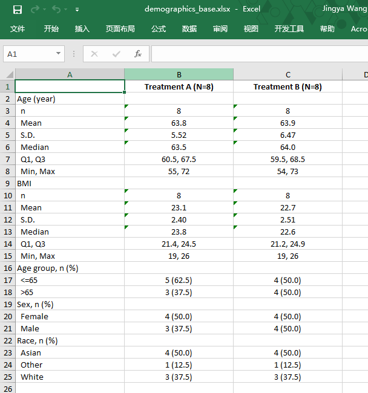
```

.tip-box[
`createWorkbook()` → `addWorksheet()` → `writeData()` → `saveWorkbook()`  
是 `openxlsx` 的标准四步流程，可在此基础上叠加样式。
]

]

---
class: animated, fadeIn

# 5.3 df to Word：`flextable` + `officer`

.panelset[
.panel[.panel-name[flextable 核心用法]
.pull-left[
### 构建与主题

| 函数 | 作用 |
|---|---|
| `flextable(df)` | 从 data.frame 创建表对象 |
| `theme_booktabs()` | 三线表主题 |
| `set_header_labels(col = "标签")` | 覆盖列头显示文字 |
| `add_header_lines("文字")` | 在列头上方添加标题行 |
| `add_footer_lines(c(...))` | 在表格底部添加脚注行 |

### 字体与对齐

| 函数 | 作用 |
|---|---|
| `font(fontname=, part=)` | 设置字体 |
| `fontsize(size=, part=)` | 字号 |
| `bold(i=, part=)` | 加粗（`i` 精确定位行） |
| `align(j=, align=, part=)` | 对齐（"left"/"center"/"right"）|

### 宽度控制

| 函数 | 作用 |
|---|---|
| `autofit()` | 按内容自动调整列宽 |
| `fit_to_width(max_width=)` | 撑满指定宽度（英寸）|
]
.pull-right[

### `i` / `j` 精确定位

```{r eval=FALSE}
# header 第 1 行 = add_header_lines() 添加的标题行
# header 第 2 行 = 原始列头行
bold(i = 1, part = "header")   # 标题行加粗
bold(i = 2, part = "header")   # 列头加粗
align(j = 2:3, align = "center", part = "all")  # 第2-3列居中
```

### `part` 参数范围

| 值 | 作用域 |
|---|---|
| `"all"` | 标题行 + 列头 + 表体 + 脚注 |
| `"header"` | 列头区域（含 `add_header_lines` 行）|
| `"body"` | 表体（数据行）|
| `"footer"` | 脚注区域 |

.tip-box[
`add_header_lines()` 添加的行编号为 header 第 1 行，  
原始列头行自动后移为第 2 行。
]
.warn-box[
`theme_booktabs()` 会重置字体格式，  
必须在 `font()` / `bold()` 等格式设置**之前**调用。
]

]
]
.panel[.panel-name[示例]
.pull-left[
```{r}
library(flextable)

ft <- head(demo_table_base, 7) %>%
  setNames(c("Characteristic", names(.)[-1])) %>%
  flextable() %>%
  set_header_labels(Characteristic = "") %>%          # 第一列头显示为空
  add_header_lines(                                   # ← 标题放进 flextable
    "Table 14.1.2.1.1  Demographics and Baseline Characteristics (FAS)") %>%
  add_footer_lines(c(                                 # ← 脚注放进 flextable
    "N = number of subjects randomized in each treatment group.",
    "Percentages are based on column N as denominator."
  )) %>%
  theme_booktabs() %>%                                # 三线表（须在字体设置之前）
  font(fontname = "Times New Roman", part = "all") %>%
  fontsize(size = 9, part = "all") %>%
  bold(i = 1, part = "header") %>%                   # 标题行加粗
  bold(i = 2, part = "header") %>%                   # 列头加粗
  align(j = 2:3, align = "center", part = "all") %>% # 第 2-3 列居中
  autofit() %>%
  fit_to_width(max_width = 9.5)                          # 撑满横向可用宽度（11" - 页边距×2）
```

.green-box[
**标题 / 脚注放进 `flextable` 的好处**  
- 与表格一体，内容缩进自动对齐  
- `fit_to_width()` 同时作用于标题行  
- `officer` 部分仅负责文档容器与版面，代码更简洁
]
]

.pull-right[
## 结果展示
```{r echo=FALSE}
ft
```
.warn-box[
**局限（flextable 设计限制，非代码问题）**  
`add_header_lines()` 本质是在 header 区域插入额外行，标题会被包裹在**表格边框内部**，而非位于表格上方的独立段落。若需要标题完全独立于表格之外，仍需改用`officer`包在输出时插入。
]
]

]

.panel[.panel-name[`officer`：写入 Word 文档]

.pull-left[
### 文档操作函数

| 函数 | 作用 |
|---|---|
| `read_docx()` | 新建（或打开）Word 文档对象 |
| `body_add_flextable(ft)` | 插入 flextable 表格 |
| `body_add_fpar(fpar(...))` | 插入有格式的文字段落 |
| `body_add_par("文字", style=)` | 插入普通段落（引用 Word 样式）|
| `body_add_break()` | 插入分页符 |
| `body_end_block_section(...)` | 应用当前节的版面设置 |
| `print(doc, target=)` | 保存为 .docx 文件 |

### 有格式文字：`fpar` + `ftext`

```{r eval=FALSE}
fp <- fp_text(bold = TRUE, font.size = 10,
              font.family = "Times New Roman")
body_add_fpar(fpar(ftext("标题文字", fp)))
```

.note-box[
`body_add_par(..., style = "Normal")` 使用 Word 内置样式，  
`body_add_fpar(fpar(ftext(...)))` 直接指定格式，不依赖样式名，  
避免 Word 默认标题样式带来的自动编号问题。
]
]
.pull-right[
### 页面设置：`prop_section`

```{r eval=FALSE}
landscape_section <- prop_section(
  page_size = page_size(
    orient = "landscape",
    width  = 11.69,   # A4 宽（英寸）
    height = 8.27     # A4 高
  ),
  page_margins = page_mar(
    bottom = 1, top    = 1,
    right  = 1, left   = 1,
    header = 1, footer = 1   # 页眉/页脚距纸边各 1"
  )
)
```

### 示例

```{r eval=FALSE}
doc <- read_docx() %>%
  body_add_flextable(ft) %>%
  body_set_default_section(landscape_section)  #<< 整个文档横向
print(doc, target = "demographics_base.docx")
```
.note-box[
两个可以控制输出页面格式的函数：
`body_end_block_section` 作用于**当前节**（支持混排纵/横）；  
`body_set_default_section` 作用于**整份文档**的默认版面。
]
]
]
.panel[.panel-name[完整输出示例]
.pull-left[
### ① flextable：仅负责表格样式，不放标题/脚注
```{r}
library(flextable)
library(officer)

ft <- demo_table_base %>%
  setNames(c("Characteristic", names(.)[-1])) %>%
  flextable() %>%
  set_header_labels(Characteristic = "") %>%             # 第一列头显示为空
  theme_booktabs() %>%                                   # 三线表（须在字体设置之前）
  font(fontname = "Times New Roman", part = "all") %>%
  fontsize(size = 9, part = "all") %>%
  bold(part = "header") %>%                             # 列头加粗
  align(j = 2:3, align = "center", part = "all") %>%   # 第 2-3 列居中
  padding(padding.top = 1, padding.bottom = 1,          # ← 压缩行距
          part = "all") %>%
  set_table_properties(layout = "autofit", width = 1)  # ← 撑满 100% 可用宽度
```
.tip-box[
如果结果是 `rtables` 对象，先用 `rtables::tt_to_flextable()` 转换，  
再接入相同的 `officer` 写入流程。
]
]
.pull-right[
### ② officer：负责标题、表格、脚注的插入顺序，以及页面设置
```{r}
fp_title    <- fp_text(bold = TRUE,  font.size = 10, font.family = "Times New Roman")
fp_footnote <- fp_text(bold = FALSE, font.size = 8,  font.family = "Times New Roman")

landscape_section <- prop_section(
  page_size = page_size(orient = "landscape", width  = 11.69, height = 8.27),
  page_margins = page_mar(bottom = 1, top = 1, right = 1, left = 1, header = 1, footer = 1)
)

doc <- read_docx() %>%
  body_add_fpar(fpar(ftext(                              # ← 标题（表格外独立段落）
    "Table 14.1.2.1.1  Demographics and Baseline Characteristics (FAS)",
    fp_title))) %>%
  body_add_flextable(value = ft) %>%                     # ← 表格
  body_add_fpar(fpar(ftext(                              # ← 脚注行 1
    "N = number of subjects randomized in each treatment group.",
    fp_footnote))) %>%
  body_add_fpar(fpar(ftext(                              # ← 脚注行 2
    "Percentages are based on column N as denominator.",
    fp_footnote))) %>%
  body_set_default_section(landscape_section)            # ← 整份文档横向

print(doc, target = "demographics_base.docx")
```
.green-box[
**职责分离**  
`flextable` → 表格样式（字体、对齐、线型、行距、宽度）  
`officer` → 文档结构（标题 → 表格 → 脚注）+ 页面版面
]
]
]
.panel[.panel-name[输出结果展示]
```{r echo=FALSE, out.width="70%", fig.align="center"}
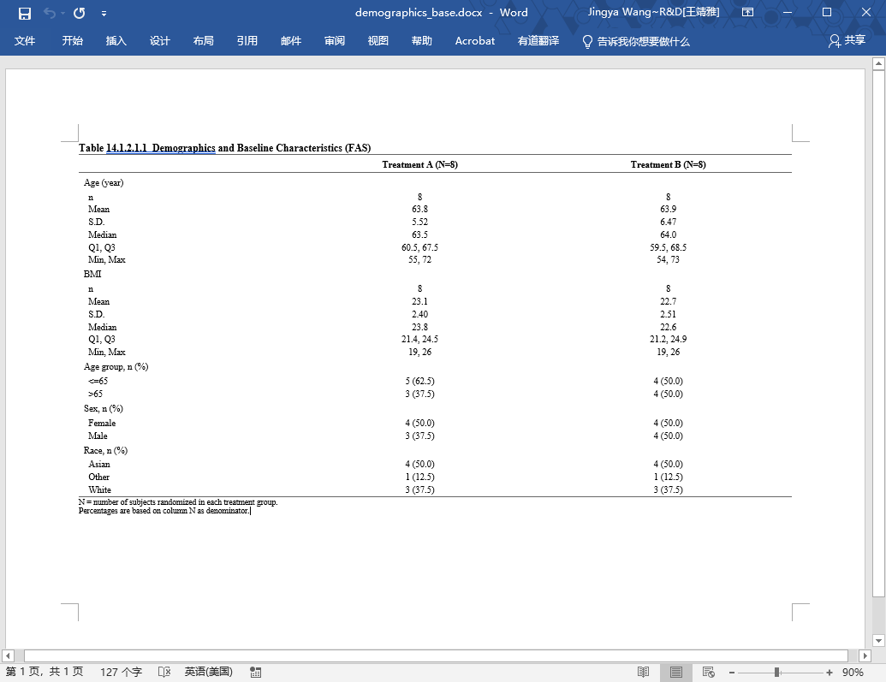
```
]
]

---
class: animated, fadeIn

# 5.4 df to RTF：`r2rtf` 

.panelset[
.panel[.panel-name[函数与参数速查]
.pull-left[
### 核心函数（管道式逐层附加）

| 函数 | 作用 |
|---|---|
| `rtf_page()` | 页面方向、页边距、每页行数 |
| `rtf_title()` | 标题行（支持多行、左对齐、字号）|
| `rtf_colheader()` | 列头（支持两行列头分层显示）|
| `rtf_body()` | 表体（列宽、对齐、边框、字体）|
| `rtf_footnote()` | 脚注（`as_table=FALSE` 为普通文字）|
| `rtf_source()` | 数据源说明行 |
| `rtf_encode()` | 编码为 RTF 字节流 |
| `write_rtf()` | 写出 .rtf 文件 |

### `rtf_page()` 参数

| 参数 | 说明 |
|---|---|
| `orientation` | `"landscape"` 横向 / `"portrait"` 纵向 |
| `margin` | `c(上,右,下,左,页眉,页脚)` 单位英寸 |
| `nrow` | 每页最大行数（超出自动分页）|
| `border_first` | 全表顶线，三线表设 `NULL` |
| `border_last` | 全表底线，三线表设 `NULL` |
]
.pull-right[
### `rtf_body()` / `rtf_colheader()` 通用参数

| 参数 | 说明 |
|---|---|
| `col_rel_width` | 列相对宽度比例，如 `c(3,2,2)` |
| `text_justification` | `"l"` 左 / `"c"` 居中 / `"r"` 右 |
| `text_format` | `"b"` 加粗 / `"i"` 斜体 / `"u"` 下划线 |
| `text_font_size` | 字号（pt）|
| `border_top/bottom` | 边框线型：`"single"` / `NULL`（无线）|
| `border_left/right` | 竖线，三线表设 `NULL` |
| `border_width` | 线宽（twips，`30` ≈ 0.42pt 细线）|

### `rtf_footnote()` / `rtf_source()` 参数

| 参数 | 说明 |
|---|---|
| `footnote` / `source` | 字符向量，每个元素一行 |
| `as_table` | `FALSE` = 普通文字段落（推荐）|
| `text_justification` | 对齐方式，通常 `"l"` |

.warn-box[
`col_rel_width` 和 `text_justification` 在 `rtf_colheader()` 与 `rtf_body()` 中**必须完全一致**，否则列头和表体错位。
]
]
]
.panel[.panel-name[三线表逻辑与示例]
.pull-left[
### 三线表边框实现逻辑

```
rtf_page(border_first = NULL,    ← 关掉全局顶线
         border_last  = NULL)    ← 关掉全局底线

rtf_colheader(header,
  border_top    = "single",     ← ① 顶线
  border_bottom = "single",     ← ② 中线
  border_left   = NULL,
  border_right  = NULL)

rtf_body(
  border_left   = NULL,
  border_right  = NULL,
  border_last   = "single")    ← ③ 底线
```

.note-box[
三线表 = 顶线（colheader1 border_top）+ 中线（colheader2 border_bottom）+ 底线（body border_last），其余全设 `NULL`。
]
]
.pull-right[
### 三线表最小示例

```{r eval=FALSE}
library(r2rtf)

demo_table_base %>%
  rtf_page(orientation = "landscape",
           border_first = NULL,
           border_last  = NULL) %>%
  rtf_colheader(
    " | Trt A \n (N=8) | Trt B \n (N=8)",
    col_rel_width      = c(3, 2, 2),
    text_justification = c("l", "c", "c"),
    border_top    = "single",   #← ① 顶线
    border_bottom = "single",   #← ② 中线
    border_left   = NULL,
    border_right  = NULL,
    border_width  = 30
  ) %>%
  rtf_body(
    col_rel_width      = c(3, 2, 2),
    text_justification = c("l", "c", "c"),
    border_left   = NULL,
    border_right  = NULL,
    border_last   = "single",   #← ③ 底线
    border_width  = 30
  ) %>%
  rtf_encode() %>%
  write_rtf("demo_3line.rtf")
```
]
]
.panel[.panel-name[标题 / 脚注 / 数据源]
.small[
.pull-left[
### `rtf_title()`：标题与副标题

```{r eval=FALSE}
rtf_title(
  title    = "Table 14.1.2.1.1 Demographics and Baseline Characteristics (FAS)",
  text_justification = "l",   # 左对齐
  text_font_size     = 9      # 字号 9pt
)
```

- 若有多行标题，可加 `subtitle` 

### `rtf_footnote()`：脚注

```{r eval=FALSE}
rtf_footnote(
  footnote = c(
    "N = number of subjects in each treatment group.",
    "Percentages are based on column N as denominator."
  ), as_table = FALSE   # 普通文字段落，不加表框
)
```

### `rtf_source()`：数据源说明

```{r eval=FALSE}
rtf_source(
  source = paste0(
    "Source: ADSL  ",
    "Date of Data Cut-off: 2026-05-15  ",
    "Date of TFL Generation: ", Sys.Date()
  ),
  text_justification = "l"
)
```
]
.pull-right[
### 中文字符处理

直接写入中文会乱码，需要先用 `utf8Tortf()` 转为 RTF unicode 转义序列：

**title / footnote / source（单字符串）**
```{r eval=FALSE}
rtf_footnote(
  footnote = r2rtf::utf8Tortf("N为治疗组人数。百分比以N为分母。"),
  as_table = FALSE
)
```

**table body 整列批量转**
```{r eval=FALSE}
# 单列
ae_table_rtf$MHDECOD <- utf8Tortf(ae_table_rtf$MHDECOD)

# 多列批量
cn_cols <- c("MHDECOD", "MHBODSYS", "TRTP")
ae_table_rtf[cn_cols] <- lapply(ae_table_rtf[cn_cols], utf8Tortf)
```

.warn-box[
含中文的列**必须先转码**再传入 `r2rtf`，否则打开后乱码。  
]
]
]
]
.panel[.panel-name[完整输出示例]
.pull-left[
```{r eval=FALSE}
library(r2rtf)

part1 <- demo_table_base %>%
  rtf_page(orientation = "landscape",
           margin = c(1,1,1,1,1,1),
           border_first = NULL,
           border_last  = NULL,
           nrow = 30) %>%
  rtf_title(
    title    = "Table 14.1.2.1.1 Demographics and Baseline Characteristics (FAS)",
    text_justification = "l",
    text_font_size     = 9
  ) %>%
  rtf_colheader(
    " | Trt A \n (N=8) | Trt B \n (N=8)",
    col_rel_width      = c(3, 2, 2),
    text_justification = c("l", "c", "c"),
    border_top    = "single",
    border_bottom = "single",
    border_left   = NULL,
    border_right  = NULL,
    border_width  = 30
  ) %>%
  rtf_body(
    col_rel_width      = c(3, 2, 2),
    text_justification = c("l", "c", "c"),
    border_left   = NULL,
    border_right  = NULL,
    border_last   = "single",   #<< 底线
    border_width  = 30
  ) %>%
```
]
.pull-right[
```{r eval=FALSE}
  rtf_footnote(
    footnote = c(
      "N = number of subjects randomized in each treatment group.",
      "Percentages are based on column N as denominator."
    ),
    as_table = FALSE
  ) %>%
  rtf_source(
    source = paste0(
      "Source: ADSL  ",
      "Date of Data Cut-off: 2026-05-15  ",
      "Date of TFL Generation: ", Sys.Date()
    ),
    text_justification = "l"
  ) %>%
  rtf_encode() %>%
  write_rtf("demographics_base.rtf")
```
]
]
.panel[.panel-name[输出结果展示]
```{r echo=FALSE, out.width="70%", fig.align="center"}
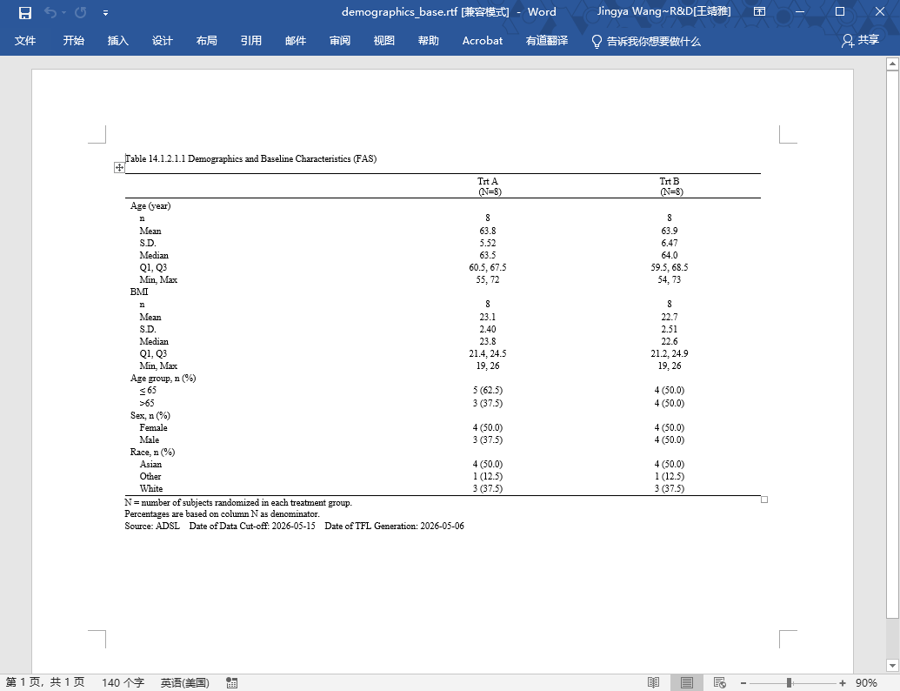
```
]
]

---
class: animated, fadeIn

# 5.5 rtables 对象的输出：三种路径

.panelset[
.panel[.panel-name[输出路径总览]
.pull-left[
```
rtables 对象（tbl）
    │
    ├─── as_html()  ────────────────────→ HTML
    │
    ├─── export_as_rtf()  ──────────────→ .rtf
    │
    ├─── tt_to_flextable()
    │        └─ body_add_flextable()  ──→ .docx
    │
    └─── as_result_df()
             └─ write.xlsx()  ─────────→ .xlsx
```

### rtables 对象支持的原生输出

| 格式    | 函数                    | 适用场景                      |
|---------|-------------------------|-------------------------------|
| ASCII   | print() / toString()    | 控制台调试、PDF 嵌入          |
| HTML    | as_html()               | 浏览器、RMarkdown HTML、Shiny 展示    |
| RTF     | export_as_rtf()         | 正式 TFL 文件交付             |

### 需要先转换的格式

| 格式 | 转换函数 | 接续函数 |
|---|---|---|
| **Word** | `tt_to_flextable()` | `officer::body_add_flextable()` |
| **Excel** | `as_result_df()` | `openxlsx::write.xlsx()` |

]
.pull-right[
.small[
```{r}
as_html(demo_table_tern)
```
]
]
]
.panel[.panel-name[RTF：`export_as_rtf()`]
.pull-left[
### 用法

```{r eval=FALSE}
library(formatters)

# 最简写法
export_as_rtf(
  demo_table_tern,
  file = "demographics_tern.rtf"
)
```

### 关键参数

| 参数 | 说明 |
|---|---|
| `landscape` | `TRUE` = 横向 |
| `page_type` | `"a4"` / `"letter"` |
| `margins` | 四边页边距，单位英寸 |
| `font_family` | **必须等宽字体**（仅支持Courier）|
| `font_size` | 字号（pt）|
| `paginate` | 长表自动分页 |
]
.pull-right[
### 添加 title / footnote
.small[
title 和 footnote 存储在 rtables 对象的属性中，可用以下两种方法赋值：'
- 在 basic_table() 里直接指定
```{r eval=FALSE}
lyt <- basic_table(
  title     = "Table 14.1.2.1.1  ...",
  subtitles = "Demographics and Baseline Characteristics (FAS)"
) %>% ...
```
- 在 build_table 之后设置
```{r eval=FALSE}
main_title(demo_table_tern) <- "Table 14.1.2.1.1 Demographics and Baseline Characteristics (FAS)"

main_footer(demo_table_tern) <- c(
  "N = number of subjects randomized in each treatment group.",
  "Percentages are based on column N as denominator."
)

export_as_rtf(demo_table_tern, file = "demographics_tern.rtf",
              landscape = TRUE, page_type = "a4",
              font_family = "Courier", font_size = 9)
```
]
.warn-box[
**三线表格式：`export_as_rtf()` 不支持**  
该函数基于 ASCII 字符渲染，输出结果为等宽字体的纯文本表格，无法控制单元格边框（`border_top/bottom` 等 RTF border 属性）。  
若需要三线表或 TFL 模板样式 → 用 `as_result_df()` 转 data.frame 使用 **`r2rtf`**。
]
]
]
.panel[.panel-name[RTF输出结果展示]
```{r echo=FALSE, out.width="70%", fig.align="center"}
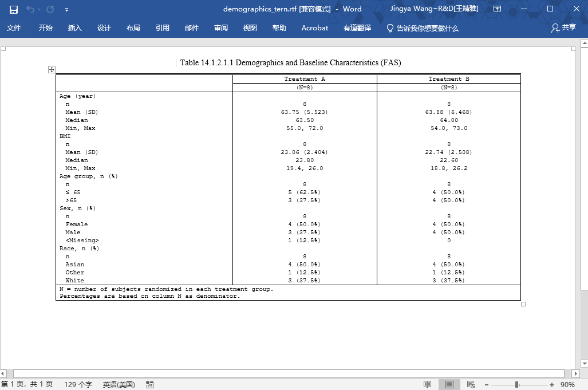
```

]
.panel[.panel-name[Word：`tt_to_flextable()`]
.pull-left[
### `tt_to_flextable()` 关键参数

| 参数 | 默认值 | 说明 |
|---|---|---|
| `tt` | — | rtables 表对象（必填）|
| `theme` | `theme_rtables` | 默认主题（带竖线网格），**生产场景建议替换** |
| `titles_as_header` | `TRUE` | 将 `main_title()` 放入 header 区域 |
| `integrate_footers` | `TRUE` | 将 `main_footer()` 放入 footer 区域 |
| `bold_headers` | `TRUE` | 列头加粗 |
| `indent_size` | `2` | 层级缩进宽度（字符数）|
.note-box[
`tt_to_flextable()` 现在位于 `rtables.officer` 包中（旧版在 `rtables` 包），  
调用前确认已安装：`install.packages("rtables.officer")`
]
.tip-box[
转换后得到的是普通 flextable 对象，可继续调用所有 `flextable` 函数叠加样式，  
再接入与 5.3 节完全相同的 `officer` 写入流程。
]
]
.pull-right[
### 默认 `theme_rtables` vs 三线表 `theme_booktabs`

```{r eval=FALSE}
# 默认：保留 rtables 的竖线网格样式（不推荐用于正式 TFL）
tt_to_flextable(demo_table_tern)

# 三线表：替换为 booktabs（临床 TFL 推荐）
tt_to_flextable(
  demo_table_tern,
  theme             = theme_booktabs,   #<<
  titles_as_header  = FALSE,  # 标题交给 officer 插入
  integrate_footers = FALSE   # 脚注交给 officer 插入
)
```
.pull-left[
#### 默认
```{r echo=FALSE, out.width="90%", fig.align="center"}
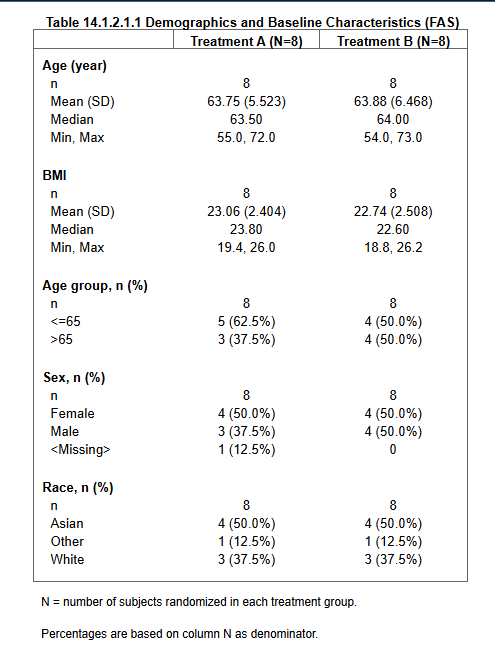
```
]
.pull-right[
#### 三线表
```{r echo=FALSE, out.width="90%", fig.align="center"}
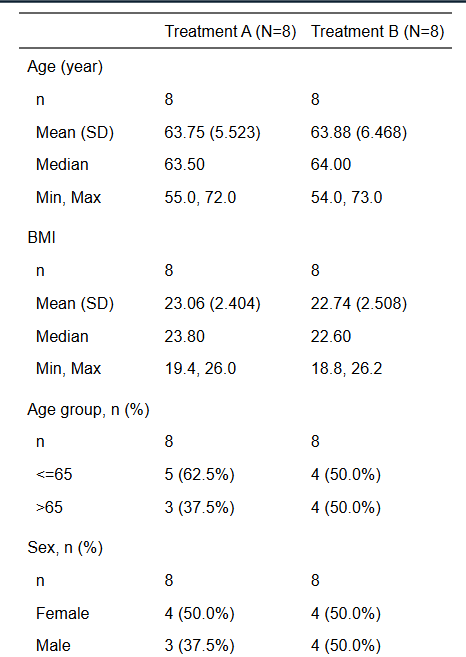
```
]
]
]
.panel[.panel-name[Word输出结果展示]
.pull-left[
```{r}
# Step 1：rtables 对象 → flextable 格式
ft_tbl <- rtables.officer::tt_to_flextable( #<<
    demo_table_tern, 
    titles_as_header = F, 
    integrate_footers  = F
  ) %>% 
  flextable::theme_booktabs(bold_header = T) %>%
  font(fontname = "Times New Roman", part = "all") %>%
  fontsize(size = 9, part = "all") %>%
  bold(part = "header") %>%                             # 列头加粗
  align(j = 2:3, align = "center", part = "all") %>%   # 第 2-3 列居中
  padding(padding.top = 1, padding.bottom = 1,          # ← 压缩行距
          part = "all") %>%
  set_table_properties(layout = "autofit", width = 1)
```
```{r echo=FALSE, out.width="90%", fig.align="center"}
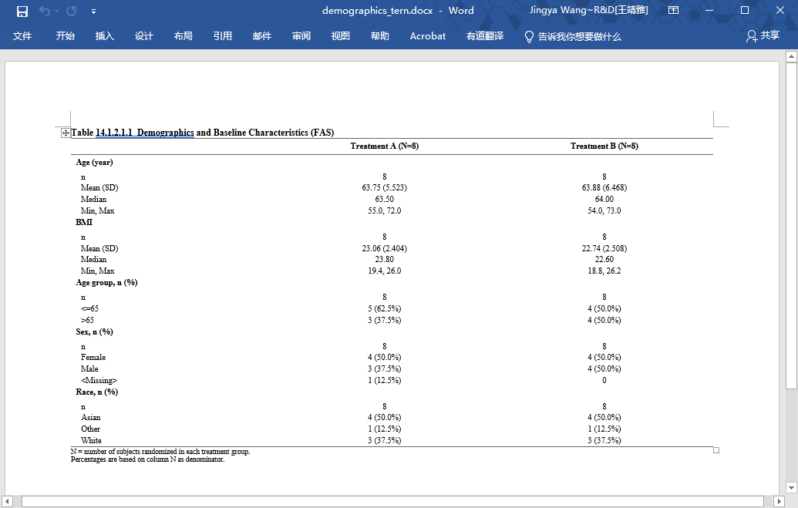
```
]
.pull-right[
```{r}
# Step 2：用 officer 写入 Word
fp_title    <- fp_text(bold = TRUE,  font.size = 10, font.family = "Times New Roman")
fp_footnote <- fp_text(bold = FALSE, font.size = 8,  font.family = "Times New Roman")
landscape_section <- prop_section(
  page_size = page_size(orient = "landscape", width  = 11.69, height = 8.27),
  page_margins = page_mar(bottom = 1, top = 1, right = 1, left = 1, header = 1, footer = 1)
)
doc <- read_docx() %>%
  body_add_fpar(fpar(ftext(                              # ← 标题（表格外独立段落）
    "Table 14.1.2.1.1  Demographics and Baseline Characteristics (FAS)",
    fp_title))) %>%
  body_add_flextable(value = ft_tbl) %>%                     # ← 表格
  body_add_fpar(fpar(ftext(                              # ← 脚注行 1
    "N = number of subjects randomized in each treatment group.",
    fp_footnote))) %>%
  body_add_fpar(fpar(ftext(                              # ← 脚注行 2
    "Percentages are based on column N as denominator.",
    fp_footnote))) %>%
  body_set_default_section(landscape_section)            # ← 整份文档横向

print(doc, target = "demographics_tern.docx")
```
]
]
.panel[.panel-name[Excel：`as_result_df()`]
.pull-left[
### `as_result_df()` 参数说明

| 参数 | 默认值 | 说明 |
|---|---|---|
| `tt` | — | rtables 表对象（必填）|
| `data_format` | `"full_precision"` | 数值精度格式：`"full_precision"` 保留内部全精度数值；`"strings"` 保留表格显示格式（如 `"12 (75.0%)"`）；`"numeric"` 以可见精度输出数值型 |
| `simplify` | `TRUE` | 把层级行标签合并为一列字符串；`FALSE` 则每层单独一列 |
| `expand_colnames` | `FALSE` | `TRUE` = 嵌套列头展开为多行（列头变成 data.frame 的前几行）|
| `keep_label_rows` | `FALSE` | 是否保留分组标题行（只有标签、无统计值的行）|
| `label_var` | `"row_name"` | 合并后的行标签列名 |
| `na_level` | `"<NA>"` | 缺失单元格填充字符 |

.warn-box[
所有统计值列均为**字符型**（保留显示格式如 `"12 (75.0%)"`）。
]

.note-box[
`simplify = TRUE`（默认）最常用：  
层级结构折叠为带缩进前缀的单列，Excel 中视觉层次清晰；  
`simplify = FALSE` 适合需要按层级做 pivot 的场景。
]
]
.pull-right[
### 转换为 data.frame 再写 Excel

```{r}
library(rtables)
library(openxlsx)

# Step 1：rtables 对象 → data.frame
df_out <- as_result_df(
  demo_table_tern,
  data_format = "strings", # 保留和table一致的格式
  simplify        = TRUE,  # 层级标签合并为一列（带缩进前缀）
  expand_colnames = TRUE,  # 嵌套列头展开为多行
  keep_label_rows = TRUE   # 保留分组标题行，Excel 中层次更清晰
)

# 查看结构
head(df_out)
```
```{r eval = F}
# Step 2：写入 Excel（最简）
write.xlsx(df_out, "demographics_tern.xlsx")
```

.tip-box[
需要更精细样式（加粗标题行、设列宽、冻结首行）时，  
改用 `openxlsx` 工作簿写法（见 §5.2）叠加 `addStyle()`。
]
]
]
]

---

name: sec6
class: inverse, center, middle, animated, fadeIn

# § 6
# Advance: Survival Analysis 怎么出？

.section-num[6]

.footnote[[↑ 返回目录](#toc)]

---
class: animated, fadeIn

# 6.1 生存分析场景与数据准备

.pull-left[
### 临床常见 time-to-event 终点

- **OS** — Overall Survival
- **PFS** — Progression-Free Survival
- **DoR** — Duration of Response
- **TTR** — Time to Response

### 技术栈关系

```
survival        ← 底层建模（KM / Cox）
    ↓
tern::surv_time()  ← 贴近 TFL 的上层接口
    ↓
rtables         ← 表格布局引擎
    ↓
formatters / r2rtf  ← 输出
```
]
.pull-right[
### 构建 `surv_df`

`survival` 需要时间变量 AVAL + 事件标记，从 ADSL 补充：

```{r}
surv_df <- adsl %>%
  mutate(
    AVAL = c(14.2,10.8,16.4,8.1,12.5,18.0,7.4,13.1,
             15.0,11.2,9.5,12.0,17.2,6.8,10.4,14.8),
    CNSR = c(0,1,0,1,0,0,1,0,1,0,0,1,0,1,0,0),
    is_event = CNSR == 0   # CNSR=0 = 事件发生（未删失）
  )
```

.warn-box[
**调用生存函数前必须确认：**  
- `is_event` 事件定义与分析口径一致  
- 时间单位（月 / 天）已正确处理  
- 删失规则与 SAP 对齐
]
]

---
class: animated, fadeIn

# 6.2 `survival` 包基础语法
.panelset[
.panel[.panel-name[`Surv()`基础]
.pull-left[
### `Surv()` 对象

`Surv(time, event)` 是 survival 包的核心数据结构，将时间与事件状态绑定：

| 参数 | 说明 |
|---|---|
| `time` | 随访时间（通常为 AVAL，单位：月/天）|
| `event` | 事件标记：`TRUE`/`1` = 事件发生；`FALSE`/`0` = 删失 |

```{r}
library(survival)
# 输出示例："+" 表示删失时间点
Surv(surv_df$AVAL, surv_df$is_event)
```

.note-box[
`is_event = CNSR == 0` 是 CDISC 删失规则的标准转换：  
`CNSR = 0` = 未删失（事件发生）；`CNSR = 1` = 删失。  
]
]
.pull-right[
### 用法

```{r eval=FALSE}
# KM 估计
survfit(
  formula,          # Surv(time, event) ~ 分组变量
  data,             # 数据框
  conf.int = 0.95,  # 置信水平（默认 95%）
  conf.type = "log" # CI 方法（同 control_surv_time）
)

# KM plot
survminer::ggsurvplot(
  survfit(formula, data),
  data
)

# Cox 模型
coxph(
  formula,   # Surv(time, event) ~ 协变量1 + 协变量2
  data,
  ties = "efron"  # 处理并列事件（"efron"/"breslow"/"exact"）
)


```

.tip-box[
- `survfit()` → KM 估计，给出每个时间点的累计生存概率
- `ggsurvplot()` → 可视化 KM 曲线（需先运行 `survfit()`）
- `coxph()` → Cox 模型，给出协变量对风险比的效应
]
]
]
.panel[.panel-name[Kaplan-Meier 估计]
.pull-left[
### 代码

```{r}
km_fit <- survfit(
  Surv(AVAL, is_event) ~ ARM,
  data = surv_df
)
summary(km_fit)
```
]
.pull-right[
.small[
### KM 输出列含义

| 列名 | 含义 |
|---|---|
| `time` | 事件发生时间点 |
| `n.risk` | 该时间点仍在随访中的人数 |
| `n.event` | 该时间点发生事件的人数 |
| `survival` | 累计生存概率 $\hat{S}(t)$ |
| `std.err` | $\hat{S}(t)$ 的标准误 |
| `lower/upper 95% CI` | 生存率 95% 置信区间 |

**从 `summary` 读分位数**

| 分位数 | 对应条件 | 直接提取 |
|---|---|---|
| 25% | 找 `survival ≤ 0.75` 的第一行时间 | `quantile(km_fit, 0.25)` |
| 50%（中位数）| 找 `survival ≤ 0.50` 的第一行时间 | `quantile(km_fit, 0.50)` |
| 75% | 找 `survival ≤ 0.25` 的第一行时间 | `quantile(km_fit, 0.75)` |

```{r}
# 一次性获取 Q1/Median/Q3 + 95% CI
quantile(km_fit, probs = c(0.25, 0.5, 0.75))
```
]
]
]
.panel[.panel-name[Cox 比例风险模型]
.pull-left[
### 代码

```{r}
cox_fit <- coxph(
  Surv(AVAL, is_event) ~ ARM,
  data = surv_df
)
summary(cox_fit)
```
.note-box[
本例：  
- `ARMTreatment B`：HR = **1.39**，p = 0.626，95% CI = (0.37, 5.27)
]
]
.pull-right[
### Cox 输出关键字段

| 字段 | 含义 |
|---|---|
| `exp(coef)` | **风险比 HR**|
| `Pr(>/z/)` | Wald 检验 p 值 |
| `lower/upper .95` | HR 的 95% CI |
| `Concordance` | 一致性指数（0.5=随机，1=完美）|

### 提取 HR 及置信区间
```{r}
exp(coef(cox_fit)) # HR（exp(coef)）
exp(confint(cox_fit)) # 95% CI（原 log scale 的 CI 取指数）
broom::tidy(cox_fit, exponentiate = TRUE, conf.int = TRUE) # 返回列：term / estimate(HR) / conf.low / conf.high / p.value
```
]
]
.panel[.panel-name[KM 图：`survminer`]
.pull-left[
### 代码

```{r eval=FALSE}
library(survminer)

ggsurvplot(
  km_fit,
  data       = surv_df,
  fun = "pct",
  risk.table = TRUE,   # 在图下方附风险人数表
  risk.table.col = "strata",
  risk.table.y.text = FALSE,
  break.time.by = 3,  # 统一 x 轴刻度间隔，使 KM 图与风险表对齐
  pval       = TRUE,   # 显示 log-rank p 值
  conf.int   = TRUE,   # 显示 95% CI 色带
  palette    = c("#E7B800", "#2E9FDF"),
  xlab       = "Time (Months)",
  ylab       = "Survival Probability (%)",
  legend.labs = c("Treatment A", "Treatment B")
)
```
]
.pull-right[
### 图形元素说明

| 元素 | 含义 |
|---|---|
| 阶梯曲线 | KM 估计的累计生存概率 |
| 色带 | 95% 置信区间 |
| `+` 标记 | 删失时间点 |
| 风险人数表 | 各时间点仍在随访的人数 |
| p 值 | log-rank 检验结果 |

```{r echo=FALSE, out.width="90%", fig.align="center"}
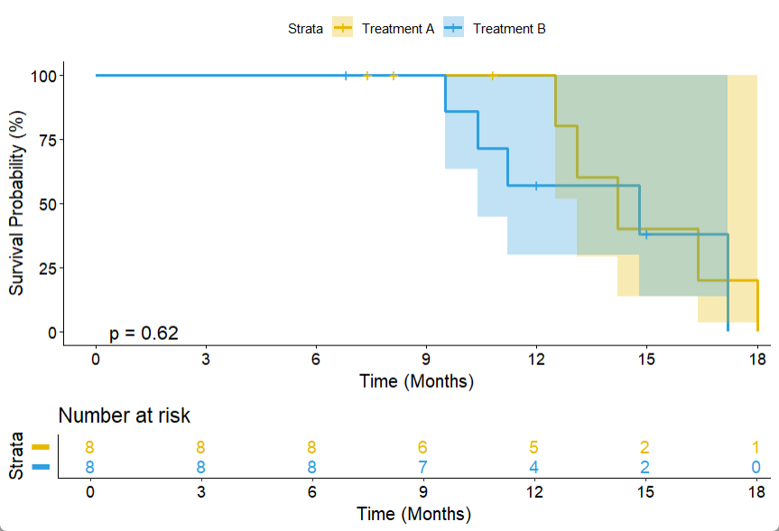
```
]
]
]

---
class: animated, fadeIn

# 6.3 `tern::surv_time()` 参数详解

.panelset[
.panel[.panel-name[核心参数]
.pull-left[
### 函数签名

```{r eval=FALSE}
surv_time(
  lyt,                       # layout 对象
  vars,                      # 时间变量名（字符串）
  var_labels  = vars,        # 表中行标题
  is_event,                  # 事件标记变量名（字符串）
  .stats      = c("median", "median_ci",
                  "quantiles", "range"),
  .labels     = NULL,        # named vector，覆盖行标签
  .formats    = NULL,        # named vector，覆盖格式标签
  control     = control_surv_time()
)
```
### 参数说明

| 参数 | 说明 |
|---|---|
| `vars` | 时间变量名，通常为 `"AVAL"` |
| `is_event` | 事件标记变量名，`TRUE/1` = 事件发生 |
| `var_labels` | 表中该变量的行标题，默认同 `vars` |
| `.stats` | 输出哪些统计量（见下一面板）|
| `.labels` | named vector，覆盖各统计量的行标签 |
| `.formats` | named vector，覆盖显示格式 |
| `control` | 传入 `control_surv_time()` 配置 CI 方法 |

]
.pull-right[
### 常用 `.stats` 值

| `.stats` 值 | 输出内容 | 格式示例 |
|---|---|---|
| `"n_events"` | 事件数 n (%) | `6 (75.0%)` |
| `"median"` | 中位生存时间 | `13.2` |
| `"median_ci"` | 中位数 95% CI | `(8.10, 16.40)` |
| `"quantiles"` | Q1 和 Q3 | `10.2 to 15.3` |
| `"range"` | Min - Max | `6.8 to 18.0` |

### 常用组合

```{r eval=FALSE}
# 常用
.stats = c("median", "median_ci", "quantiles")
```
.note-box[
`"median_ci"` 的 CI 方法由 `control_surv_time()` 控制，  
默认为 `"plain"`（Greenwood 公式线性区间）。
]
]
]
.panel[.panel-name[`control_surv_time()`]
.pull-left[
### 参数一览

| 参数 | 默认值 | 说明 |
|---|---|---|
| `conf_level` | `0.95` | 置信水平 |
| `conf_type` | `"plain"` | CI 计算方法 |
| `quantiles` | `c(0.25, 0.75)` | 分位数，默认 Q1/Q3 |


### `conf_type` 选项
| 值 | 方法 | 特点 |
|---|---|---|
| `"plain"` | Greenwood 线性 | 简单，可能超界 |
| `"log"` | 对数变换 | 保证正值 |
| `"log-log"` | 双对数变换 | 适合小样本 |
| `"logit"` | logit 变换 | 结果在 (0,1) 内 |
| `"none"` | 不计算 CI | — |
]
.pull-right[
### 示例

```{r eval=FALSE}
control = control_surv_time(
  conf_level = 0.95,
  conf_type  = "log-log"   #<< SAP 常指定
)
```

.warn-box[
**SAP 核查点**：`conf_type` 须与 SAP 规定一致。  
默认为`"plain"`，若 SAP 指定 `log-log`，须显式传入。
]

.note-box[
`quantiles = c(0.25, 0.75)` 对应 `.stats = "quantiles"` 时的输出分位点，  
若需中位数以外的其他分位数，可改为 `c(0.1, 0.9)`。
]
]
]
.panel[.panel-name[完整示例]
.pull-left[
```{r}
library(tern)

lyt_surv <- basic_table(show_colcounts = TRUE) %>%
  split_cols_by("ARM") %>%
  surv_time(
    vars       = "AVAL",
    var_labels = "Overall Survival (Months)",
    is_event   = "is_event",
    .stats = c("median", "median_ci", "quantiles"),
    control = control_surv_time(conf_level = 0.95,
                                conf_type  = "log-log")
  )

tbl_surv <- build_table(lyt_surv, surv_df)
```
]
.pull-right[
```{r echo=FALSE}
tbl_surv
```
]
]
]

---

class: center, middle, animated, fadeIn

# 总结：base R vs tidyverse vs rtables vs tern

| 维度 | base R | tidyverse | rtables | tern |
|:---|:---:|:---:|:---:|:---:|
| 学习门槛 | 低 | 低～中 | 较高，需理解 layout | 中（在 rtables 之上）|
| 算法透明度 | 高 | 高 | 中（自写 afun 可见）| 低（高度封装）|
| 代码量 | 多 | 中 | 中 | 少 |
| 临床表复用性 | 一般 | 中 | 高 | 最高 |
| 层级表支持 | 手动拼 | 手动拼 | 原生支持 | 原生支持 |
| 定制灵活性 | 最高 | 高 | 高（自写 afun）| 参数化控制 |
| 适合场景 | 教学 / 调试 | 日常数据处理 | 非标准 / 复杂定制 | 生产 / 标准 TFL |

.green-box[
**学习路径建议**：先通过 base R / tidyverse 理解底层算法，再引入 rtables/tern 提升效率。  
理解每一行的计算逻辑，是正确运用高层框架、避免机械套用的前提。
]

.note-box[
**四者关系**：base R / tidyverse 相互独立；`rtables` 提供表格布局引擎；  
`tern` 在 `rtables` 之上封装临床分析函数。  
实际生产中：`tern` 调用 `rtables`，`rtables` 调用 `formatters`。
]

---

name: homework
class: animated, fadeIn

# 课后练习

.pull-left[
### Part A：base R 出表

1. 用 base R 重做一张 `Weight` 和 `BMI` 的连续变量汇总表
   - 定义通用 `cont_stats()` 函数
   - 用 `split()` + `lapply()` 按 ARM 计算
   - 格式化为临床表显示文本

2. 把 `ETHNIC`（Ethnicity）加入 Demographics Table
   - 注意 ETHNIC 取值较长，观察格式化输出效果

### Part B：rtables / tern 出表

3. 把 `SEX`、`RACE`、`ETHNIC` 改成 `tern::analyze_vars()` 输出
   - 记得先把变量转成 `factor`
   - 尝试指定 level 顺序

4. 用 `count_occurrences()` 输出一张 Medical History 表
   - 构造一个 MH 明细数据框
   - 用 `alt_counts_df = adsl_count` 正确指定列分母
]

.pull-right[
### Part C：输出

5. 把最终 Demographics 结果分别导出为：
   - `.xlsx`（`openxlsx`）
   - `.docx`（`flextable` + `officer`）
   - `.rtf`（`r2rtf` 和 / 或 `formatters::export_as_rtf()`）
   - 比较三种格式的视觉差异和适用场景

### Part D：Survival Analysis

6. 基于 `adsl` 单独构建 `surv_df`（补充 `AVAL`、`CNSR`、`is_event`）
7. 用 `survival::survfit()` 做 KM 估计，打印 `summary()`
8. 用 `tern::surv_time()` 输出同一份数据的 Median OS 表

.note-box[以上练习基于本章 `adsl` + 单独构建的 `surv_df` 完成]
]

---
class: animated, fadeIn, center, middle

# 谢谢！

.large[作者：王靖雅]

.gray[第五章 · 临床汇总表的计算与输出 · 2026]

.footnote[本 slides 使用 [xaringan](https://github.com/yihui/xaringan) 制作]

