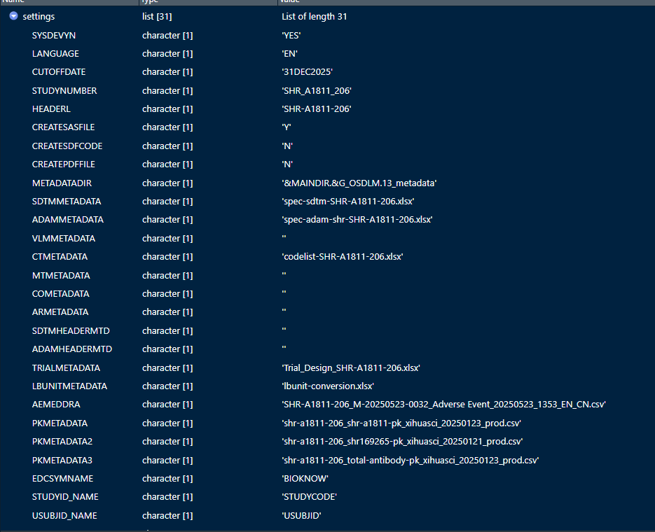
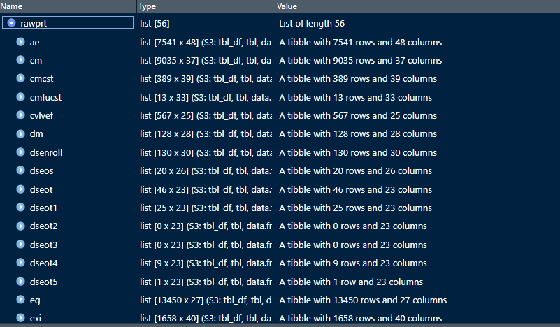
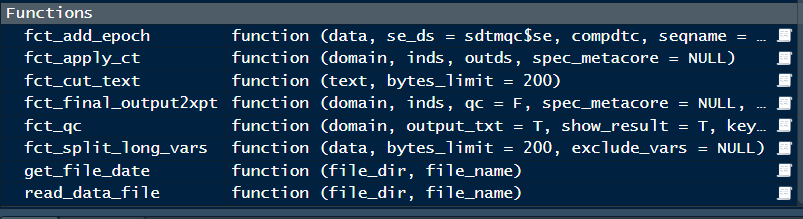

## R项目结构

> 案例来源SHR-1811-206项目，QC部分用R写代码，spec和codelist共用main的一套

## 目录  
- [00-rev.R](#00-rev.R)
- [00-setup.R](#00-setup.R)
- [batchrun工具 - batchrun-app.R](#batchrun-工具---batchrun-app.R)

### 00-renv.R
【由lead programmer创建和控制，其他人不建议修改】

使用renv管理包安装环境，保证项目的可复现性。
本项目已包含大多数常用package，在代码中不要自行安装package，如需安装请咨询项目负责人。

{renv}说明网址：https://rstudio.github.io/renv/articles/renv.html

### 00-setup.R
【由lead programmer创建和控制，其他人不建议修改】

类似于SAS项目中的setup.sas，主要用于加载包、定义函数、读取spec等，供后续代码调用。
读取iniprt.txt中内容并存放至文件中使用

代码讲解：
rm(list=ls()) -- 清空环境变量，保证每次运行代码时环境变量一致，避免之前的变量对结果造成影响

#### STEP1. path设定：储存在Environment的path变量中，调用方式如path\$logqc、path\$outqc

#### STEP2. settings设定：来源于iniprt.txt文件，储存在Environment的settings变量中，调用方式如settings\$LANGUAGE、settings\$AEMEDDRA

#### STEP3. spec和codelist读取：储存在Environment的spec_metacore变量中
基于metacore和metatools包的逻辑，储存spec和codelist并运用包提供的函数进行处理。后续会详细讲解相关调用方式。
参考用法：
xx_spec <- spec_metacore %>% select_dataset('xx')
xx_spec$ds_vars -- 可查看domain所有变量，同时提供排序变量信息以及supp变量信息

同时提供以下读入的spec和codelist的文件数据方便查看：

{metatools}说明网址：https://pharmaverse.github.io/metatools/
{metacore}说明网址：https://atorus-research.github.io/metacore/
其中metacore为spec和codelist设置成spec_metacore的相关函数，metatools为调用spec_metacore的相关函数。

#### STEP4. rawprt：读取rawdata中sas数据，并储存至Environment的rawprt变量中，调用方式如rawprt\$ae、rawprt\$dm

注：为了避免每次读取数据消耗时间过长，数据读取后会存储至01_setup/rawdata-31DEC2025.rds中，日期来源于settings\$CUTOFFDATE，如settings\$CUTOFFDATE设定未变更，默认raw中数据并未发生版本变化，只读取对应存储的文件，当CUTOFFDATE发生变化后，会对rawdata数据再次读取并存储为新的rds文件。

#### STEP5. sdtmprt、sdtmqc：来源于main和qc使用r生成的sdtm数据，主要便于写代码时直接调用，避免费时读取sas数据，调用方式如sdtmqc\$ae、sdtmqc\$dm
对应的rds文件会存储到对应side的01_setup文件夹中，调用fct_final_output2xpt程序输出时会自动对这些文件进行更新。

#### STEP6. function读取：来源于08_macro即path\$mcrprt和path\$mcrqc的用户自定义函数，会自动读入Environment中方便调用

#### RELOAD PART：上述相关基础信息会保存至01_setup/setup.RDATA文件中，如需清楚当前运行环境并重新回复setup设定，可以直接运行以下代码
rm(list=ls())
load(file.path(getwd(), "/01_setup/setup.RDATA"))

注：直接读取setup.RDATA是调用的上次运行setup文件时的spec和codelist内容，如需更新相关信息，需重新跑00-setup.R文件

### batchrun 工具 - batchrun-app.R
> 批量运行并输出log的batchrun工具，基于rshiny页面开发

使用方式：
1. 在项目rstudio中打开文件 -> 点击右上角Run APP，即可看到操作界面
   
   
2. 选择要运行的程序（支持多选和排序），点击【运行选中的程序】，可自由选择是否输出warning，运行结束后，会出现本次运行的代码是否成功，并在【本次运行输出】中查看对应的log信息
   
3. 【程序代码】部分支持用户快速修改代码中的小问题，选择【编辑程序】后可进行编辑，如需保存修改需点击【保存修改】，同时会生成一个之前版本的backup文件。
   注：主要修改建议在rstudio中进行。
   
   
4. 【历史运行日志】和【QC结果检查】可查看10_log的log内容以及11_output中的qc output结果。