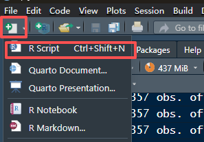
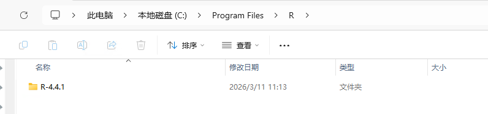
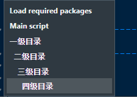

# 02-R程序常见用法

> 包含一些程序创建和使用方式

## 1. 创建R程序


设置标题部分：打开 Tools -> Global Options -> Code -> Edit Snippets -> 添加以下片段 -> 使用时只需输入 rheader然后按Tab键，即可快速出现注释内容

```R
snippet rheader
	#' =============================================================================
	#'
	#' A Simple Description of Purpose of the R Script
	#'
	#' =============================================================================
	#'
	#' Program Name:   ${2:xx.R}
	#' Date Created:   `r format(Sys.Date(), "%Y-%m-%d")`
	#' Author:         `r Sys.getenv("USER")`
	#' Project:        ${3:Project Name}
	#'
	#' Purpose:        To generate a ${1:xx} dataset for Project ${3:Project Name}.
	#'
	#' Inputs:         ${4}
	#' Outputs:        ${5}
	#' Dependencies:   ${6}
	#'
	#' Notes: 
	#'
	#' =============================================================================
	#'
	#' Modification History
	#'
	#' =============================================================================
	#'
	#' Version  Date        Modified by             Modification(s)
	#' -------  ----------  ----------------------  -------------------------------
	#' 1.0      `r format(Sys.Date(), "%Y-%m-%d")`        `r Sys.getenv("USER")`    Initial version
	#'
	#' =============================================================================
	
	# Load required packages -------------------------------------------------------
	# library(xxx)

	# Get the specifications for the dataset we are currently building
	Domain = "XX"
	xx_spec <- spec_metacore %>% select_dataset(Domain)
	xx_spec$ds_vars

	# Main script ------------------------------------------------------------------
	${0}
```

## 2. 打开R程序
可以直接在RStudio的Files中找到对应文件夹下的R程序，点击即可打开


## 3. 运行R程序
单行运行：鼠标点代码行，按Ctrl + Enter（Mac上是Cmd + Enter）即可运行当前行代码，或点击文件右上角的RUN按钮


多行运行：选中多行代码，按Ctrl + Enter或点击RUN按钮即可运行选中部分代码。

文件运行：点击文件右上角的Source按钮，或Ctrl + A全选后按Ctrl + Enter即可运行整个文件代码。


## 4. R程序目录
为了美观可以用以下方式来进行区分
```R
	# 一级目录 ------------------------------------------------------------------
	## 二级目录 ----
	### 三级目录 ----
	#### 四级目录 ----

	# 没有后面符号的这种是备注，当目录用后面得至少有四个符号（=或-或#）
```


## 5. function程序格式参考
```R
#' =============================================================================
#'
#' General Functions
#'
#' =============================================================================
#'
#' @name fct_add_epoch
#'
#' @description
#' Add EPOCH information to dataset by matching dates with SE domain.
#'
#' @param data Input dataset containing subject records
#' @param se_ds SE (Subject Elements) dataset, default is sdtmqc$se
#' @param compdtc Name of the comparison date variable in data
#' @param seqname Name of the sequence variable, default is "xxSEQ"
#'
#' @returns Dataset with EPOCH variable added based on date matching rules
#'
#' @examples
#' result <- fct_add_epoch(ds_data, se_ds = sdtmqc$se, compdtc = "DSSTDTC", seqname = "DSSEQ")
#'
#' =============================================================================
#'
#' Modification History
#'
#' =============================================================================
#'
#' Version  Date        Modified by             Modification(s)
#' -------  ----------  ----------------------  -------------------------------
#' 1.0      2026-02-11  Jingya Wang          Initial version
#'
#' =============================================================================

# Load required packages -------------------------------------------------------
# library(haven)
# library(diffdf)

# Main Function ----------------------------------------------------------------
fct_add_epoch <- function(data, se_ds = sdtmqc$se, compdtc, seqname = paste0(Domain, "SEQ")) {

	## 可以增加识别部分比如，stop语句可以让程序直接跳出并显示指定错误信息
	# # Check USUBJID (should typically exist)
	# if (!"USUBJID" %in% names(data)) {
	#   stop("Error: 'USUBJID' variable not found in data. This is required for subject identification.")
	# }

	## 可以使用warning语句来输出一些程序运行中的警告信息，提示用户可能存在的问题，但程序仍会继续运行
	# # Check optional variable: SUBJID
	# has_subjid <- "SUBJID" %in% names(data)
	# if (!has_subjid) {
	#   warning("Warning: 'SUBJID' variable not found in data. Will only use 'USUBJID' for processing.")
	# }

	## 可以使用message语句来输出一些程序运行中的提示信息，方便调试和了解程序进展
	# message("Starting to add EPOCH variable based on SE dataset...")


	## 可以用tryCatch来捕获可能出现的错误，并提供更友好的错误信息，帮助定位问题
	# tryCatch({
	# 	## 运行程序
	# }, error = function(e) {
	# 	stop(paste0("ERROR: Domain '", toupper(domain), "' not found in spec_metacore. ", conditionMessage(e))) ## conditionMessage可以获取原始错误信息，帮助调试
	# })

	## 最后return输出结果
	return(xxx)
}
```

