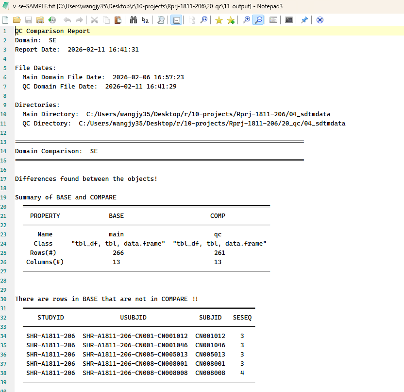
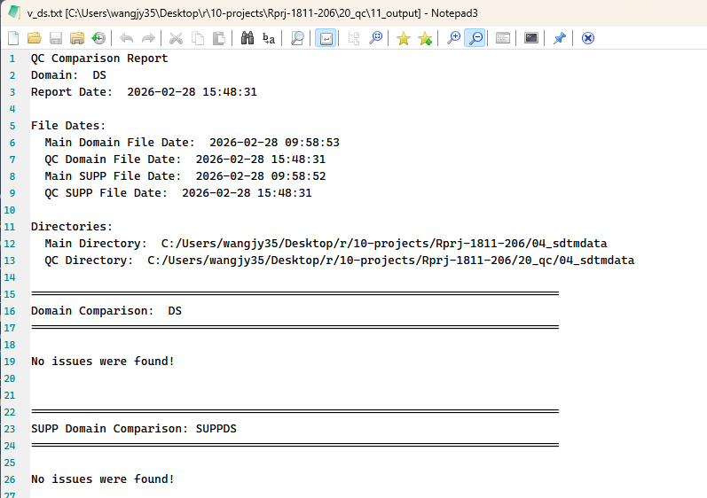

# 03-内置funcion介绍


## 

## 字段截取：fct_cut_text和fct_split_long_vars

调用案例：


## 进行codelist转换：fct_apply_ct


## 结果输出：fct_final_output2xpt
> 用于输出domain数据至xpt文件

调用案例：
```R
    fct_final_output2xpt(domain = "SV", inds = sv_final, qc = T, settings = settings)
    # domain：赋值为对应domain名
    # inds：最终版的domain文件，需进行过CT处理
    # qc：T or F，表示是否输出到qc文件夹
    # spec_metacore：内置变量，无需赋值，会自动从运行环境读取
    # path：内置变量，无需赋值，会自动从运行环境读取
    # settings：内置变量，无需赋值，会自动从运行环境读取
```

内置逻辑：
1. 识别所需变量是否齐全
2. 对输入数据进行处理，依次进行以下操作：
   1. 将变量转化为spec规定格式
   2. 检查是否包含spec所需变量并删除无关变量
   3. 按照spec变量顺序进行展示
   4. 按照TOC中keys变量进行排序
   5. 规范输出变量的长度，label等信息，输出为xpt格式文件
3. 如存在supp变量，将生成对应supp数据集，并按照上述步骤进行输出。
4. 输出内容同时保存至04_sdtmdata/xx.xpt和01_setup/sdtmdata-31DEC2025.rds文件中存档，同时更新Environment中的sdtmprt/sdtmqc内容。

<hr>

## 结果QC：fct_qc
> 用于QC数据集，并将结果输出至11_output文件夹

调用案例：
```R
    fct_qc(domain = Domain, output_txt = T, show_result = T,
       key_vars = c("STUDYID", "USUBJID", "SUBJID", "DSSEQ"),
       path=path)
    # domain：赋值为对应domain名
    # output_txt：T or F, F则不输出txt
    # show_result：T or F, F则不输出比对结果到console中
    # key_vars：默认为空，会按照数据集顺序进行比对，可添加变量用于定义比对数据中的唯一行，需确保这些变量在数据集保证唯一性，否则会报错。
    # path_main、path_qc：内置变量，会根据Domain来判断使用是sdtm还是adam路径
    # path_qclog：内置变量，默认为path$outqc即11_output，如需输出至10_log，可填写为path$logqc
    # path：内置变量，无需赋值，会自动从运行环境读取
```

内置逻辑：
1. 读取MAIN和QC数据，会对sas数据或xpt数据文件进行读取
2. 使用diffdf::diffdf函数对数据进行比对
3. 整理并输出比对结果为v_xx.txt文件

比对文件参考：


