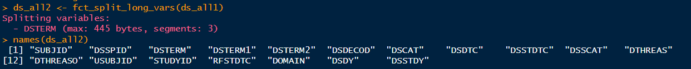
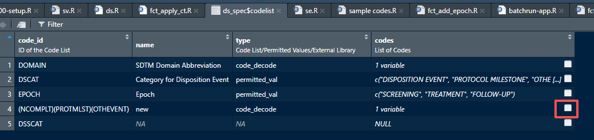
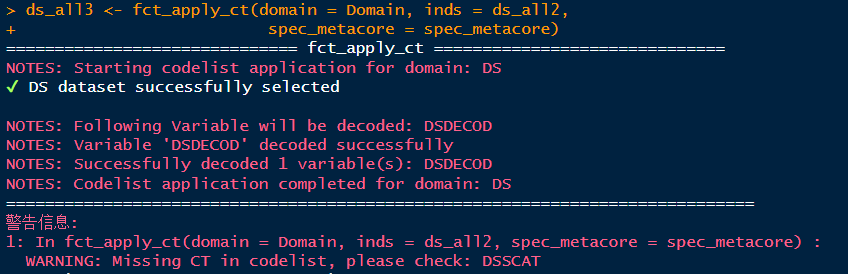
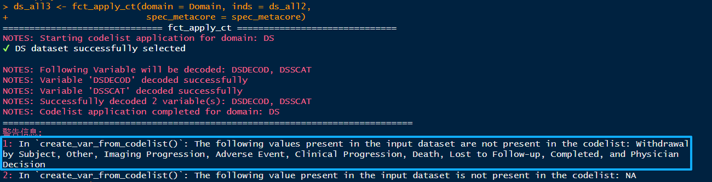
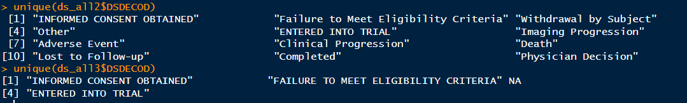
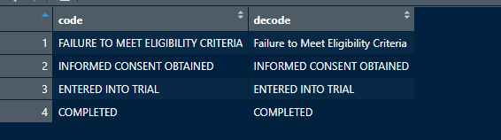
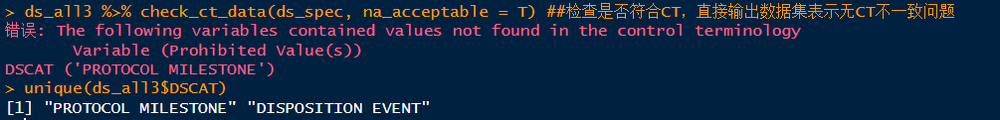
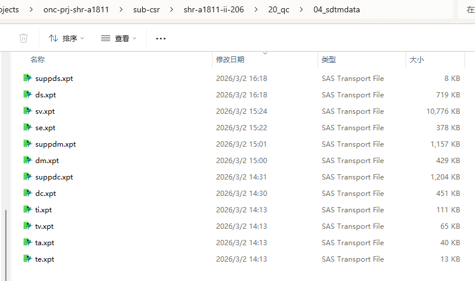
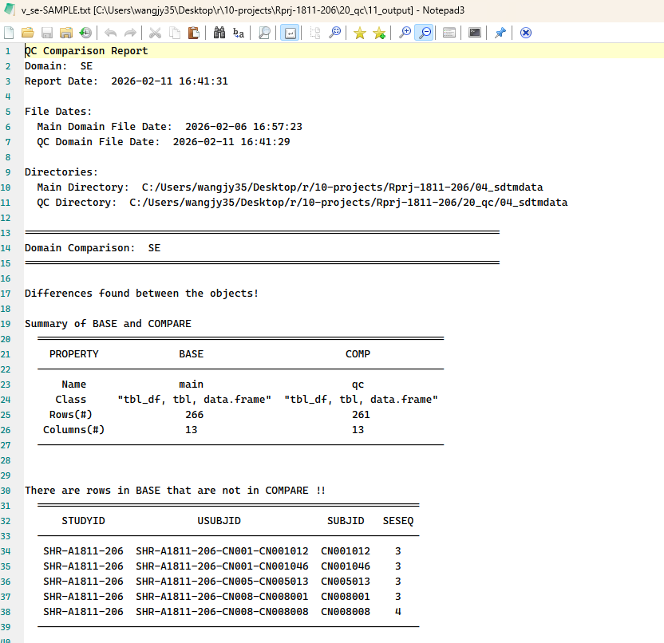
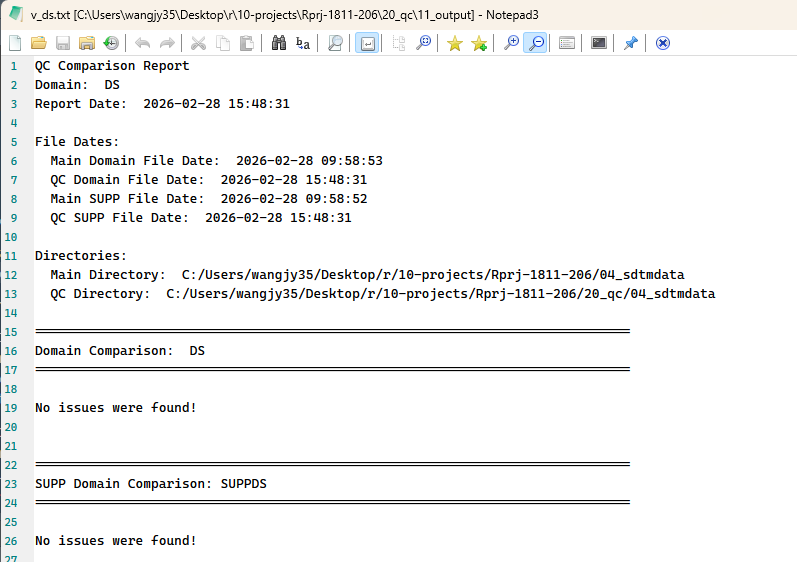

# 03-内置funcion介绍

## 字段截取：fct_cut_text和fct_split_long_vars
> fct_split_long_vars会自动识别数据中长度字符超过200的变量并进行cut；
> fct_cut_text为其内置函数，用于将一个字段按照固定长度进行分割；

调用案例：
```R
    ds_all2 <- fct_split_long_vars(ds_all1)
    # data：传入数据
    # bytes_limit：默认为200
    # exclude_vars：默认为空，可添加排除无需处理的变量
```


## 进行codelist转换：fct_apply_ct
> 根据spec中填写的CT和codelist，对数据集中变量进行CT转换

调用案例：
```R
    ds_all3 <- fct_apply_ct(domain = Domain, inds = ds_all2,
                         spec_metacore = spec_metacore)
    # domain：赋值为对应domain名
    # inds：传入数据
    # spec_metacore：内置变量，无需赋值，会自动从运行环境读取
```

### TIPS: 关于如何查看codelist

可通过view(ds_spec$codelist)查看spec，type中能看到两种类型code_decode和permitted_val。当codelist中decode=charcode时，type为permitted_val，不相同时为code_decode，可调用上述函数进行decode_to_code的转换。NA值为spec中需要的CT，但codelist文件并未识别到对应值。


点击右边的小框框可查看CT包含的具体值。

### TIPS: 当codelist缺失时
1. 对于在codelist未勾选，但spec中存在的CT，会在运行fct_apply_ct时出现如下警告。
   

2. 对于type=code_decode的变量，如果codelist中勾选的值缺失或大小写不一致，则无法成功进行转换，只会输出NA值（如下图）。在运行fct_apply_ct时会出现如下警告，需注意辨识。
   
   

3. 对于type=permitted_val的变量，可使用check_ct_data检查CT中勾选的codelist值和数据集中变量值是否一致。下图为变量中存在codelist中未勾选值时的error输出。
    


## 匹配epoch：fct_add_epoch
> 匹配epoch，需具备变量XXSEQ

调用案例：
```R
    ds_final <- fct_add_epoch(ds_all4, se_ds = sdtmqc$se, compdtc = "DSSTDTC")
    # data：传入数据
    # se_ds：默认为qc侧SE，可修改se_ds = sdtmprt$se
    # compdtc：数据集判断epoch基于的日期变量
    # seqname：默认为当前Domain的SEQ变量名，如不存在则无法进行后续匹配处理
```

## 结果输出：fct_final_output2xpt
> 用于输出domain数据至xpt文件

调用案例：
```R
    fct_final_output2xpt(domain = "SV", inds = sv_final, qc = T, settings = settings)
    # domain：赋值为对应domain名
    # inds：最终版的domain文件，需进行过CT处理
    # qc：T or F，表示是否输出到qc文件夹
    # spec_metacore：内置变量，无需赋值，会自动从运行环境读取
    # path：内置变量，无需赋值，会自动从运行环境读取
    # settings：内置变量，无需赋值，会自动从运行环境读取
```

内置逻辑：
1. 识别所需变量是否齐全

2. 对输入数据进行处理，依次进行以下操作：

   1. 将变量转化为spec规定格式

   2. 检查是否包含spec所需变量并删除无关变量

   3. 按照spec变量顺序进行展示

   4. 按照TOC中keys变量进行排序

   5. 规范输出变量的长度，label等信息，输出为xpt格式文件

3. 如存在supp变量，将生成对应supp数据集，并按照上述步骤进行输出。

4. 输出内容同时保存至04_sdtmdata/xx.xpt和01_setup/sdtmdata-31DEC2025.rds文件中存档，同时更新Environment中的sdtmprt/sdtmqc内容。



### TIPS: 关于如何使用sas读取r中输出的xpt文件

```SAS
libname xptin xport  "Z:\projects\onc-prj-shr-a1811\sub-csr\shr-a1811-ii-206\20_qc\04_sdtmdata\ds.xpt";
libname datasets 'Z:\projects\onc-prj-shr-a1811\sub-csr\shr-a1811-ii-206\20_qc\04_sdtmdata\sas'; *输出文件夹;
proc copy in=xptin out=datasets;
run;
```

<hr>

## 结果QC：fct_qc
> 用于QC数据集，并将结果输出至11_output文件夹

调用案例：
```R
    fct_qc(domain = Domain, output_txt = T, show_result = T,
       key_vars = c("STUDYID", "USUBJID", "SUBJID", "DSSEQ"),
       path=path)
    # domain：赋值为对应domain名
    # output_txt：T or F, F则不输出txt
    # show_result：T or F, F则不输出比对结果到console中
    # key_vars：默认为空，会按照数据集顺序进行比对，可添加变量用于定义比对数据中的唯一行，需确保这些变量在数据集保证唯一性，否则会报错。
    # path_main、path_qc：内置变量，会根据Domain来判断使用是sdtm还是adam路径
    # path_qclog：内置变量，默认为path$outqc即11_output，如需输出至10_log，可填写为path$logqc
    # path：内置变量，无需赋值，会自动从运行环境读取
```

内置逻辑：
1. 读取MAIN和QC数据，会对sas数据或xpt数据文件进行读取

2. 使用diffdf::diffdf函数对数据进行比对

3. 整理并输出比对结果为v_xx.txt文件

比对文件参考：




## 输出部分调用案例

>来源ds.R

```R
## 5. together ----
ds_all1 <- bind_rows(ds1, ds2, ds3, ds4) %>%
  left_join(sdtmqc$dc %>% select(USUBJID, SUBJID, STUDYID), by = "SUBJID") %>%
  left_join(sdtmqc$dm %>% select(USUBJID, RFSTDTC), by = "USUBJID") %>%
  mutate(DOMAIN = Domain,
         DSDY = as.numeric(ymd(DSDTC) - ymd(substr(RFSTDTC, 1, 10))) + as.numeric(DSDTC >= substr(RFSTDTC, 1, 10)),
         DSSTDY = as.numeric(ymd(DSSTDTC) - ymd(substr(RFSTDTC, 1, 10))) + as.numeric(DSSTDTC >= substr(RFSTDTC, 1, 10)))

## substring
ds_all2 <- fct_split_long_vars(ds_all1)

## apply CT ----
ds_all3 <- fct_apply_ct(domain = Domain, inds = ds_all2,
                         spec_metacore = spec_metacore)
ds_all3 %>% check_ct_data(ds_spec, na_acceptable = T) ##检查是否符合CT，直接输出数据集表示无CT不一致问题

## ADD XXSEQ
ds_all4 <- ds_all3 %>%
  sort_by_key(ds_spec) %>% # 等于arrange(STUDYID, USUBJID,SUBJID, DSDECOD, DSSTDTC, DSSCAT)，已TOC中keys变量顺序为准
  group_by(USUBJID) %>%
  mutate(DSSEQ = 1:n()) %>%
  ungroup()

## ADD EPOCH
ds_final <- fct_add_epoch(ds_all4, se_ds = sdtmqc$se, compdtc = "DSSTDTC")

## export as xpt ----
fct_final_output2xpt(domain = Domain, inds = ds_final, qc = T,
                     settings = settings)

## qc & output as txt ----
fct_qc(domain = Domain, output_txt = T, show_result = T,
       key_vars = c("STUDYID", "USUBJID", "SUBJID", "DSSEQ"),
       path=path)

```