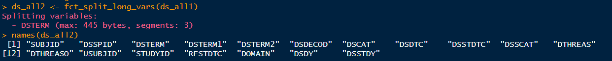
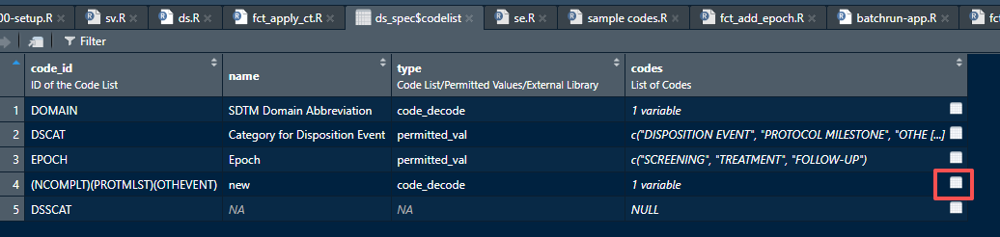
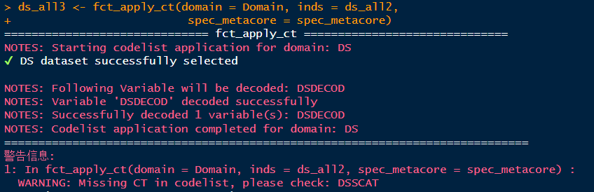
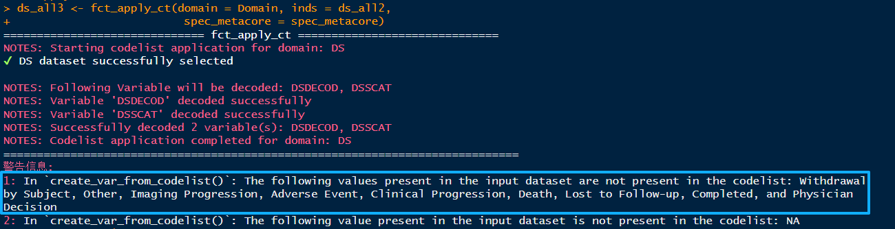
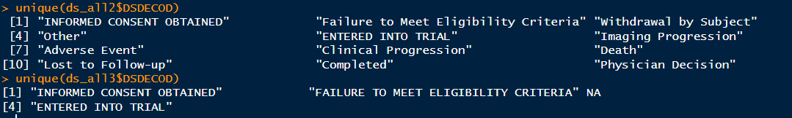
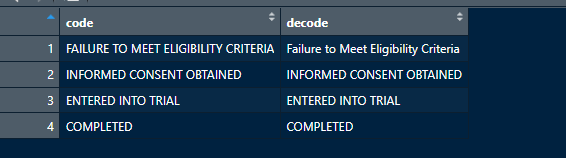
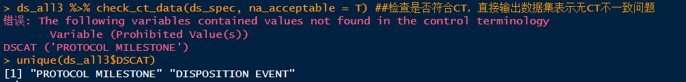
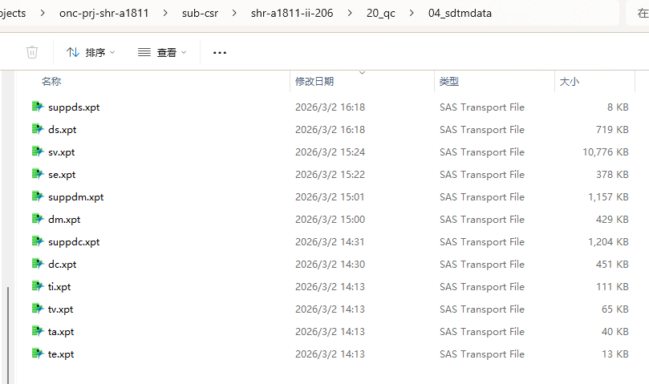
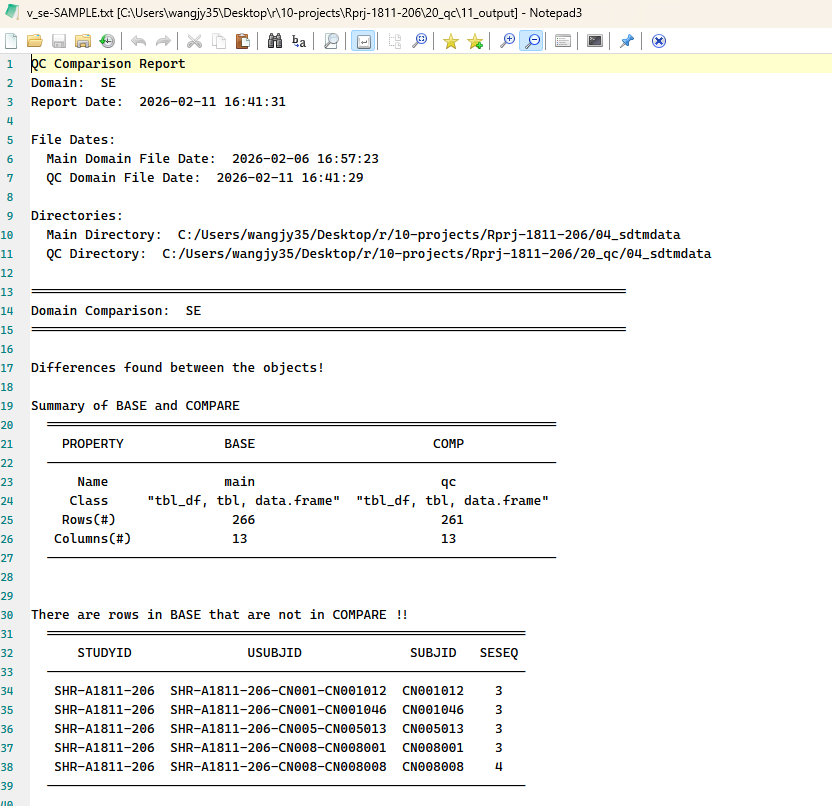
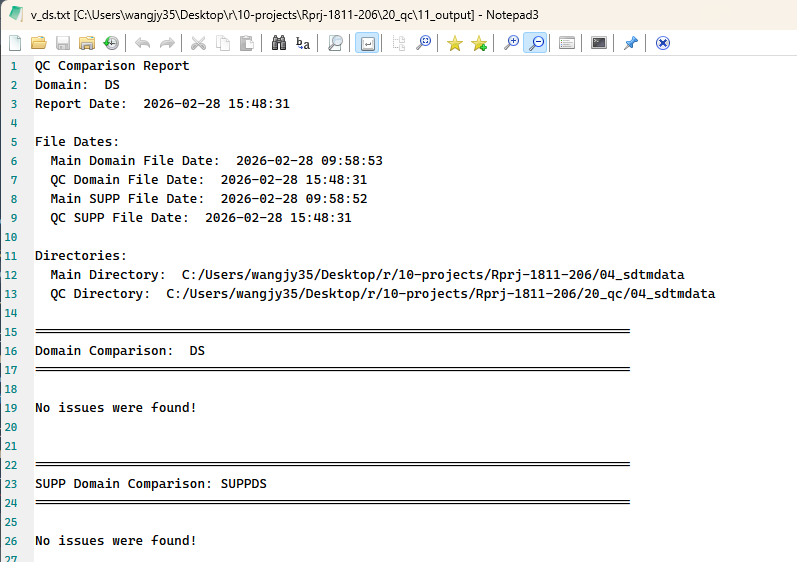

# 03-内置funcion介绍

## 字段截取：fct_cut_text和fct_split_long_vars
> fct_split_long_vars会自动识别数据中长度字符超过200的变量并进行cut；
> fct_cut_text为其内置函数，用于将一个字段按照固定长度进行分割；

调用案例：
```R
ds_all2 <- fct_split_long_vars(ds_all1)
```

| 参数 | 默认值 | 说明 |
|------|--------|------|
| `data` | — | 传入数据 |
| `bytes_limit` | `200` | 每个变量允许的最大字节数 |
| `exclude_vars` | `NULL` | 可传入字符向量排除无需处理的变量 |



## 匹配epoch：fct_add_epoch / fct_compute_epoch
> 匹配epoch，需具备变量XXSEQ（`fct_add_epoch`）。
> 
> `fct_compute_epoch` 为新增部门function版本，epoch匹配逻辑更精确。【推荐使用】

调用案例：
```R
## 旧版
ds_final <- fct_add_epoch(ds_all4, se_ds = sdtmqc$se, compdtc = "DSSTDTC")

## 新版（推荐，逻辑更精确）
ds_final <- fct_compute_epoch(ds_all4, compdtc = "DSSTDTC", se_ds = sdtmqc$se)
```

**`fct_add_epoch` 参数：**

| 参数 | 默认值 | 说明 |
|------|--------|------|
| `data` | — | 传入数据 |
| `se_ds` | `sdtmqc$se` | SE数据集，可修改为 `sdtmprt$se` |
| `compdtc` | — | 数据集中用于判断epoch的日期变量名 |
| `seqname` | 当前Domain的SEQ变量名 | 如不存在则无法进行后续匹配处理 |

**`fct_compute_epoch` 参数（推荐）：**

| 参数 | 默认值 | 说明 |
|------|--------|------|
| `df` | — | 传入数据，需包含 `USUBJID` 及 `compdtc` 指定的日期变量 |
| `compdtc` | — | 用于判断epoch的日期变量名（ISO 8601格式字符变量） |
| `se_ds` | `sdtmqc$se` | SE数据集，需包含 `USUBJID`、`EPOCH`、`SESTDTC`、`SEENDTC`、`TAETORD` |
| `debug` | `FALSE` | 保留参数，暂未启用 |

## 排序并添加序号：fct_sort_addseq / fct_sort_add_seq
> 基于spec（metacore）中定义的key_seq进行排序；可选是否按SAS风格将NA排在前面，并可自动添加当前domain的`--SEQ`变量。
>
> `fct_sort_add_seq` 为新增部门function版本，增加了 `var_ord` 参数支持手动指定排序变量，并使用 `logger` 记录日志；旧版 `fct_sort_addseq`仍可用。

调用案例：
```R
## 旧版
ds_all4 <- fct_sort_addseq(ds_all3, na.last = FALSE, add_seq = TRUE,
                            spec_metacore = spec_metacore, domain = Domain)

## 新版（推荐）
ds_all4 <- fct_sort_add_seq(ds_all3, na.last = FALSE, add_seq = TRUE,
                            spec_metacore = spec_metacore, domain = Domain)
```

| 参数 | 默认值 | 说明 |
|------|--------|------|
| `df` / `inds` | — | 传入数据 |
| `na.last` | `TRUE` | NA值排最后；设为 `FALSE` 则按SAS风格将NA排前面 |
| `add_seq` | `FALSE` | 设为 `TRUE` 时自动新增对应domain的SEQ变量，如 `AESEQ`、`DSSEQ` |
| `var_ord` ⭐ | `NULL` | **【`fct_sort_add_seq` 新增】** 从spec中读取排序变量；可传入字符向量手动指定，如 `c("USUBJID", "AESEQ")` |
| `spec_metacore` | 自动读取 | 内置变量，会自动从运行环境读取；也可手动传入 |
| `domain` | `Domain` | 默认从环境变量 `Domain` 中获取；`var_ord` 为NULL时用于从spec提取排序变量，`add_seq=TRUE` 时用于确定SEQ变量名 |
| `debug` | `FALSE` | **【`fct_sort_add_seq` 新增】** 保留参数，暂未启用 |

**注意事项：**在R中使用arrange排序时，NA值默认排在最后；sort排序可通过na.last参数控制NA值位置。该函数基于类似逻辑，调整NA排序位置，以满足和SAS一致的输出需求。

## 进行codelist转换：fct_apply_ct
> 根据spec中填写的CT和codelist，对数据集中变量进行CT转换；仅处理type为code_decode的变量，将code值转换为decode值。

调用案例：
```R
ds_all3 <- fct_apply_ct(domain = Domain, inds = ds_all2,
                        spec_metacore = spec_metacore)
```

| 参数 | 默认值 | 说明 |
|------|--------|------|
| `domain` | — | 对应domain名，如 `"DM"`、`"AE"` |
| `inds` | — | 传入数据 |
| `spec_metacore` | 自动读取 | 内置变量，会自动从运行环境读取 |
| `tolerant` ⭐ | `FALSE` | 严格模式：codelist中未找到的值转为NA；设为 `TRUE`（宽容模式）则保留未匹配的原始值 |
| `vars` ⭐ | `NULL` | 处理该domain下所有code_decode类型变量；可传入字符向量指定只处理特定变量，如 `c("SEX", "RACE")` |

> **[v1.1 新增]** `tolerant` 和 `vars` 参数：
> - `tolerant = TRUE` 适用于部分变量值已是decode格式、不需要转换的情况，避免转为NA
> - `vars` 参数可限定只转换特定变量，提高灵活性

### TIPS: 关于如何查看codelist

可通过view(ds_spec$codelist)查看spec，type中能看到两种类型code_decode和permitted_val。当codelist中decode=charcode时，type为permitted_val，不相同时为code_decode，可调用上述函数进行decode_to_code的转换。NA值为spec中需要的CT，但codelist文件并未识别到对应值。


点击右边的小框框可查看CT包含的具体值。

### TIPS: 当codelist缺失时
1. 对于在codelist未勾选，但spec中存在的CT，会在运行fct_apply_ct时出现如下警告。
   

2. 对于type=code_decode的变量，如果codelist中勾选的值缺失或大小写不一致，则无法成功进行转换，只会输出NA值（如下图）。在运行fct_apply_ct时会出现如下警告，需注意辨识。
   
   

3. 对于type=permitted_val的变量，可使用check_ct_data检查CT中勾选的codelist值和数据集中变量值是否一致。下图为变量中存在codelist中未勾选值时的error输出。
    

## 结果输出：fct_final_output2xpt
> 用于输出domain数据至xpt文件

调用案例：
```R
fct_final_output2xpt(domain = "SV", inds = sv_final, qc = T, settings = settings)
```

| 参数 | 默认值 | 说明 |
|------|--------|------|
| `domain` | — | 对应domain名，如 `"SV"`、`"DM"` |
| `inds` | — | 最终版的domain数据，需已完成CT处理 |
| `qc` | `FALSE` | 设为 `TRUE` 输出至qc文件夹，`FALSE` 输出至main文件夹 |
| `spec_metacore` | 自动读取 | 内置变量，会自动从运行环境读取 |
| `path` | 自动读取 | 内置变量，会自动从运行环境读取 |
| `settings` | 自动读取 | 内置变量，会自动从运行环境读取 |

内置逻辑：

1. 识别所需变量是否齐全
2. 对输入数据进行处理，依次进行以下操作：
      1. 将变量转化为spec规定格式
      2. 检查是否包含spec所需变量并删除无关变量
      3. 按照spec变量顺序进行展示
      4. 按照TOC中keys变量进行排序
      5. 规范输出变量的长度，label等信息，输出为xpt格式文件
3. 如存在supp变量，将生成对应supp数据集，并按照上述步骤进行输出。
4. 输出内容同时保存至04_sdtmdata/xx.xpt和01_setup/sdtmdata-31DEC2025.rds文件中存档，同时更新Environment中的sdtmprt/sdtmqc内容。



### TIPS: 关于如何使用sas读取r中输出的xpt文件

```SAS
libname xptin xport  "Z:\projects\onc-prj-shr-a1811\sub-csr\shr-a1811-ii-206\20_qc\04_sdtmdata\ds.xpt";
libname datasets 'Z:\projects\onc-prj-shr-a1811\sub-csr\shr-a1811-ii-206\20_qc\04_sdtmdata\sas'; *输出文件夹;
proc copy in=xptin out=datasets;
run;
```

<hr>

## 结果QC：fct_qc
> 用于QC数据集，并将结果输出至11_output文件夹

调用案例：
```R
fct_qc(domain = Domain, output_txt = T, show_result = T,
       key_vars = c("STUDYID", "USUBJID", "SUBJID", "DSSEQ"),
       path = path)
```

| 参数 | 默认值 | 说明 |
|------|--------|------|
| `domain` | — | 对应domain名，如 `"DC"`、`"DM"` |
| `output_txt` | `TRUE` | 是否输出比对结果至txt文件 |
| `show_result` | `TRUE` | 是否在console中打印比对结果 |
| `key_vars` | `NULL` | 定义主域比对唯一行的变量，需确保唯一性；为NULL时按数据集行顺序比对 |
| `key_vars_supp` ⭐ | `c("USUBJID", "IDVAR", "IDVARVAL", "QNAM", "QLABEL")` | SUPP域比对时的唯一key变量 |
| `exclude_vars` ⭐ | `NULL` | 排除不参与比对的变量 |
| `keep_data` ⭐ | `TRUE` | 是否在环境中保留比对结果数据 |
| `path_main` / `path_qc` | 自动判断 | 内置变量，根据Domain自动判断使用sdtm还是adam路径 |
| `path_qclog` | `path$outqc` | 输出路径，默认为11_output；如需输出至10_log可设为 `path$logqc` |
| `path` | 自动读取 | 内置变量，会自动从运行环境读取 |

内置逻辑：

1. 读取MAIN和QC数据，会对sas数据或xpt数据文件进行读取

2. 使用diffdf::diffdf函数对数据进行比对

3. 整理并输出比对结果为v_xx.txt文件

比对文件参考：




<!-- 
## 数据截取：sdtm_cutoff
> 对SDTM域数据应用截取规则，参考数据截取规则.txt / u_sdtm_dco.sas。支持按domain分组批量处理，截取后通过`fct_final_output2xpt`输出xpt文件。

截取规则分组：
- **Group A**：不截取，保留所有记录（TA/TE/TV/TD/TM/TI/TS/RELREC等）
- **Group B**：按单个`--DTC <= cutoff`筛选，变量不更新（LB/VS/EG/IE/PC/PE/RS/TU/TR等）
- **Group C-SET**：按`STDTC <= cutoff`筛选，`ENDTC > cutoff`时设为cutoff（EX/EC/SV/SE/SM）
- **Group C-ONGOING**：按`STDTC <= cutoff`筛选，`ENDTC > cutoff`时设ENDTC=NA、ENRTPT=ONGOING（AE/CM/MH/PR等）
- **Group C-DV**：按`STDTC <= cutoff`筛选，ENDTC/ENDY设为NA（DV）
- **DM/DC**：复杂逻辑，含RFICDTC过滤及多个日期/ARM字段级联更新

调用案例：
```R
## 最简调用（使用settings/path中的默认值）
sdtm_cutoff()

## QC模式（从path$sdtmqc读取，输出至path$sdtmqc/sdtm_cut/）
sdtm_cutoff(mode = "qc")

## 指定截取日期
sdtm_cutoff(cutoff_date = "01APR2026")

## 从命名列表批量处理（main+SUPP成对传入）
raw <- list(AE = ae_df, SUPPAE = suppae_df, DM = dm_df)
sdtm_cutoff(input_list = raw, cutoff_date = "01APR2026", mode = "qc")
```

| 参数 | 默认值 | 说明 |
|------|--------|------|
| `input_list` | `NULL` | 命名list，key为domain代码（如 `AE`、`SUPPAE`） |
| `input_path` | `path$sdtmprt` / `path$sdtmqc` | 单个 `.rds`/`.xpt` 文件路径或目录 |
| `output_path` | `<base>/sdtm_cut/` | 输出目录，不存在时自动创建 |
| `cutoff_date` | `settings$CUTOFFDATE` | 截取日期，支持 `"01APR2026"`、`"2026-04-01"` 或 `Date` 对象 |
| `domain` | `NULL` | 单文件输入时的domain代码提示（如路径文件名不明确时使用） |
| `mode` | `"main"` | `"main"` 或 `"qc"`，决定读取路径 |
| `language` | `settings$LANGUAGE` | `"EN"` 或 `"CN"`，控制 ONGOING 等文本常量 |
| `spec_metacore` | 自动读取 | 内置变量，会自动从运行环境读取 |
-->

## 输出部分调用案例

>来源ds.R

```R
## 5. together ----
ds_all1 <- bind_rows(ds1, ds2, ds3, ds4) %>%
  left_join(sdtmqc$dc %>% select(USUBJID, SUBJID, STUDYID), by = "SUBJID") %>%
  left_join(sdtmqc$dm %>% select(USUBJID, RFSTDTC), by = "USUBJID") %>%
  mutate(DOMAIN = Domain,
         DSDY = as.numeric(ymd(DSDTC) - ymd(substr(RFSTDTC, 1, 10))) + as.numeric(DSDTC >= substr(RFSTDTC, 1, 10)),
         DSSTDY = as.numeric(ymd(DSSTDTC) - ymd(substr(RFSTDTC, 1, 10))) + as.numeric(DSSTDTC >= substr(RFSTDTC, 1, 10)))

## substring
ds_all2 <- fct_split_long_vars(ds_all1)

## apply CT ----
ds_all3 <- fct_apply_ct(domain = Domain, inds = ds_all2,
                         spec_metacore = spec_metacore)
ds_all3 %>% check_ct_data(ds_spec, na_acceptable = T) ##检查是否符合CT，直接输出数据集表示无CT不一致问题

## ADD XXSEQ
ds_all4 <- ds_all3 %>%
  sort_by_key(ds_spec) %>% # 等于arrange(STUDYID, USUBJID,SUBJID, DSDECOD, DSSTDTC, DSSCAT)，已TOC中keys变量顺序为准
  group_by(USUBJID) %>%
  mutate(DSSEQ = 1:n()) %>%
  ungroup()

## ADD EPOCH
ds_final <- fct_add_epoch(ds_all4, se_ds = sdtmqc$se, compdtc = "DSSTDTC")

## export as xpt ----
fct_final_output2xpt(domain = Domain, inds = ds_final, qc = T,
                     settings = settings)

## qc & output as txt ----
fct_qc(domain = Domain, output_txt = T, show_result = T,
       key_vars = c("STUDYID", "USUBJID", "SUBJID", "DSSEQ"),
       path=path)

```