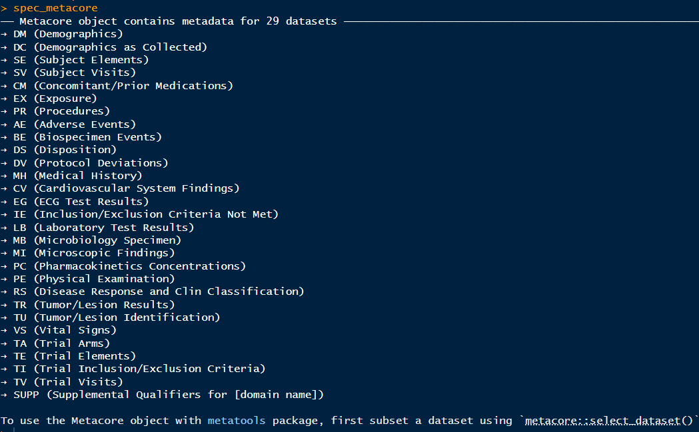
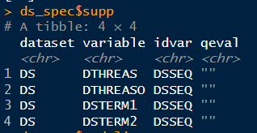
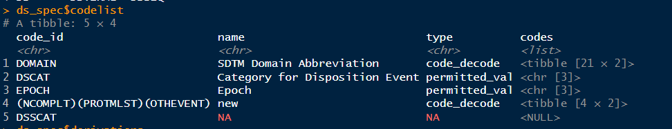
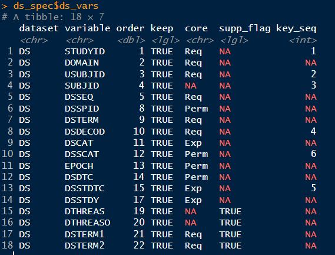

# 04-常见Rpackage介绍

> 主要介绍SHR-A1811-206项目中推荐使用到的package及相关function

## spec相关：metacore, metatools

### {metacore}设置并读取spec和codelist
> {metacore}：https://atorus-research.github.io/metacore/

具体如何读取部门spec和设置成metacore格式，请参考上述package说明网页，下面主要介绍如何使用已建好的spec_metacore。

本项目中包含的spec_metacore内容：


对于单个项目，需要使用ds_spec <- spec_metacore %>% select_dataset(Domain)进行选择，选择后包含以下内容，其中比较常用的用于检查spec的操作为：

1. ds_spec$supp: 查看该domain spec中的supp变量
   
2. ds_spec$codelist: 查看该domain spec中有CT的变量以及对应的codelist勾选的内容。
   
3. ds_spec$ds_vars: 查看该domain spec中勾选的变量以及TOC中Keys填写的排序变量和顺序
   


### {metatools}调用spec

> {metatools}：https://pharmaverse.github.io/metatools/

本项目中，{metatools}中大部分相关内容已打包至相关function中，详细参考[03-内置funcion介绍](https://jingya221.github.io/SharingNotes/notes/r-project-guide/03-%E5%86%85%E7%BD%AEfuncion%E4%BB%8B%E7%BB%8D/)。

以下是一些常见的function，比如sort_by_key()，可以直接通过读取spec的ds_vars的排序变量顺序，对当前数据进行排序，避免在代码中手动赋值。

```R
add_labels() ## Apply labels to multiple variables on a data frame
add_variables() ## Add Missing Variables
build_from_derived() ## Build a dataset from derived
build_qnam() ## Build the observations for a single QNAM
check_ct_col() ## Check Control Terminology for a Single Column
check_ct_data() ## Check Control Terminology for a Dataset
check_unique_keys() ## Check Uniqueness of Records by Key
check_variables() ## Check Variable Names
combine_supp() ## Combine the Domain and Supplemental Qualifier
convert_var_to_fct() ## Convert Variable to Factor with Levels Set by Control Terms
create_cat_var() ## Create Categorical Variable from Codelist
create_subgrps() ## Create Subgroups
create_var_from_codelist() ## Create Variable from Codelist
drop_unspec_vars() ## Drop Unspecified Variables
get_bad_ct() ## Gets vector of control terminology which should be there
make_supp_qual() ## Make Supplemental Qualifier
metatools_example() ## Get path to pkg example
order_cols() ## Sort Columns by Order
remove_labels() ## Remove labels to multiple variables on a data frame
set_variable_labels() ## Apply labels to a data frame using a metacore object
sort_by_key() ## Sort Rows by Key Sequence
```

## 数据处理：dplyr, stringr, lubridate, admiral

> {dplyr}:https://dplyr.tidyverse.org/

### 1. 数据处理

#### 1.1 基础操作

<div style="display: flex; justify-content: space-between; gap: 20px;">
  <div style="width: 48%;">
    <strong>SAS中常见代码</strong>
    <pre><code class="language-sas">
data new_data;
set mydata;
new_var = old_var * 2;
new_var2 = ifc(new_var > 10, "大", "小");

if var1 > 100 and var2 = 'A' then output;
/* 使用if-then-else */
length status $10;
if score >= 90 then status = 'Excellent';
else if score >= 80 then status = 'Good';
else if score >= 60 then status = 'Pass';
else status = 'Fail';

keep var1 var2 new_var;
drop var3 var4;
run;

proc sort data=mydata;
by descending var1 var2;
run;
    </code></pre>
  </div>
  <div style="width: 48%;">
    <strong>R中代码用法参考</strong>
    <pre><code class="language-r">
new_data <- mydata %>%
  mutate(new_var = old_var * 2, # 创建新变量
         new_var2 = ifelse(new_var > 10, "大", "小"), # ifc和ifn在R中可统一用ifelse
         status = case_when( # 多个条件判断可用case_when
            score >= 90 ~ "Excellent",
            score >= 80 ~ "Good",
            score >= 60 ~ "Pass",
            TRUE ~ "Fail"
            )
         ) %>%  
  filter(var1 > 100, var2 == "A") %>%  # 条件筛选
  select(var1, var2, new_var) %>%  # 选择/保留变量
  select(-var3, -var4) %>%  # 删除变量
  arrange(desc(var1), var2)  # 降序排列用desc()
    </code></pre>
  </div>
</div>

#### 1.2 数据类型：缺失值，重复值，字符数值转换

<div style="display: flex; justify-content: space-between; gap: 20px;">
  <div style="width: 48%;">
    <strong>SAS中常见代码</strong>
    <pre><code class="language-sas">

/* 缺失值判断 /
missing(var)

/* 处理重复值 /
/ 删除完全重复的行 */
proc sort data=mydata nodupkey;
by all;
run;

/* 删除基于关键变量的重复行 */
proc sort data=mydata nodupkey;
by id_var;
run;

/* 数据类型转换 */
data type_convert;
set mydata;
num_var = input(char_var, best12.);
char_var2 = put(num_var, best12.);
run;
    </code></pre>
  </div>
  <div style="width: 48%;">
    <strong>R中代码用法参考</strong>
    <pre><code class="language-r">

## 缺失值判断 
is.na(var) # 注意na是数据为空，但有些情况中字符型数据为""时，不属于NA，判断时需特别注意

## 处理重复值
deduped <- mydata %>%
    distinct()  # 或 distinct(.keep_all = TRUE) # 删除完全重复的行

deduped_by_id <- mydata %>%
    distinct(id_var, .keep_all = TRUE) # 删除基于关键变量的重复行

unique(mydata$vars) # 查看变量中不重复值

## 数值转换
converted <- mydata %>%
  mutate(
    num_var = as.numeric(char_var), # 字符转数值
    char_var2 = as.character(num_var), # 数值转字符
    factor_var = as.factor(category_var) # 因子转换
  )
    </code></pre>
  </div>
</div>

### 2. 分组汇总


### 3. 数据连接与转置


### 4. 字符串处理

### 5. 日期处理

### 6. 其他


## 数据读入和输出：haven, xportr


## 数据对比：diffdf


## 一些其他用法

